# Vulkan. Руководство разработчика. Настройка окружения

В этой главе мы настроим рабочую среду и установим несколько полезных библиотек. Инструменты, которые мы будем использовать, являются кроссплатформенными \(разумеется, за исключением компилятора\). Однако их установка в Windows, Linux и MacOS отличается, поэтому в руководстве каждая из этих ОС будет рассматриваться отдельно.

## Windows

Если вы занимаетесь разработкой для Windows, то, скорее всего, вы используете Visual Studio. Для полной поддержки С++17 необходимо использовать Visual Studio 2017 или 2019. Шаги, описанные ниже, подходят для VS 2017.

### Vulkan SDK

Самым важным компонентом для разработки программ с Vulkan является SDK. Он включает в себя заголовочные файлы, стандартные слои валидации, инструменты отладки и загрузчик функций Vulkan. Загрузчик ищет методы драйвера в рантайме \(во время исполнения\) так же, как это делает библиотека GLEW для OpenGL.

SDK можно загрузить с сайта [LunarG](http://vulkan.lunarg.com/). Для этого используйте кнопки внизу страницы. Вам необязательно создавать аккаунт, однако с ним у вас будет доступ к дополнительной документации.


Устанавливая SDK, запомните место установки.
Следующим шагом проверьте, поддерживает ли Vulkan ваша видеокарта и драйвер. Перейдите в папку с SDK, откройте папку `Bin` и запустите демо-проект `vkcube.exe`. Должно появиться следующее:


Если вы получили сообщение об ошибке, убедитесь, что ваша видеокарта поддерживает Vulkan, а драйвер обновлен до последней версии. См. главу [Введение](../../part1/chapter1/text.md), в которой даны ссылки на драйверы крупных производителей.

В этой папке есть и другие программы, которые могут оказаться полезными для разработки. Программы `glslangValidator.exe` и `glslc.exe` используются для компиляции шейдеров из [GLSL](https://en.wikipedia.org/wiki/OpenGL_Shading_Language) в байт-код. Подробно эта тема будет рассмотрена в главе [Шейдерные модули](https://vulkan-tutorial.com/Drawing_a_triangle/Graphics_pipeline_basics/Shader_modules). В папке `Bin` также находятся dll библиотеки загрузчика Vulkan и слоёв валидации, в папке `Lib` — статические библиотеки, а в папке `Include` – заголовочные файлы Vulkan. Вы можете изучить и другие файлы, но для руководства они нам не понадобятся.

### GLFW

Как уже было сказано, Vulkan – это API, независимый от платформы, в котором нет инструментов создания окна для отображения результатов рендеринга. Чтобы использовать преимущества кроссплатформенности Vulkan и избежать ужасов Win32, мы будем использовать библиотеку [GLFW](https://www.glfw.org/) для создания окна. Есть и другие доступные библиотеки, например, [SDL](https://www.libsdl.org/), но GLFW лучше тем, что она абстрагирует не только создание окна, но и некоторые другие платформенно-зависимые функции.

Последнюю версию библиотеки GLFW можно найти на [официальном сайте](https://www.glfw.org/download.html). В руководстве мы будем использовать 64-битные сборки, но вы, разумеется, можете выбрать и 32-битные. В этом случае убедитесь, что вы ссылаетесь на файлы Vulkan SDK в папке `Lib32`, а не в `Lib`. После скачивания распакуйте архив в удобное место. Мы создали новую папку `Libraries` в папке Visual Studio.


### GLM

В отличие от DirectX 12, в Vulkan нет библиотеки для операций линейной алгебры, поэтому ее придется скачать отдельно. [GLM](https://glm.g-truc.net/0.9.9/index.html) – это удобная библиотека, разработанная для использования с графическими API, она часто используется с OpenGL.

Библиотека GLM – это header only библиотека. Скачайте [последнюю версию](https://github.com/g-truc/glm/releases) и сохраните ее в удобном месте. У вас должна получиться подобная структура каталогов:


### Настройка Visual Studio

После установки всех библиотек мы можем настроить проект Visual Studio для Vulkan и написать немного кода, чтобы убедиться, что все работает.

Откройте Visual Studio и создайте новый проект `Windows Desktop Wizard`. Введите имя проекта и нажмите `OK`.

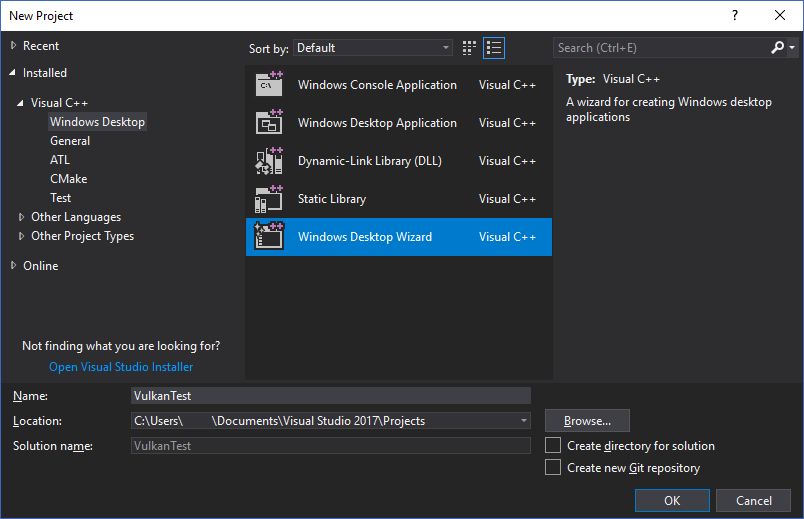

В поле `Application type` выберите `Console Application (.exe)`, чтобы видеть сообщения отладки. Также выберите `Empty Project`, чтобы Visual Studio не добавила шаблонный код.

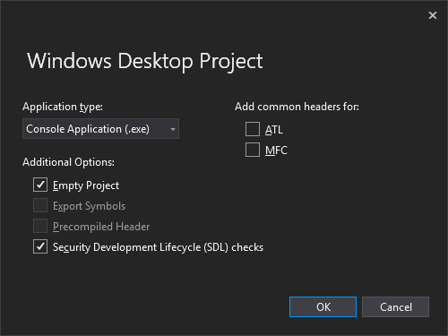

Нажмите `OK`, чтобы создать проект, и добавьте .cpp файл. Наверняка вы и так знаете, как это сделать, но мы не стали пропускать эти действия, чтобы инструкция получилась полной.

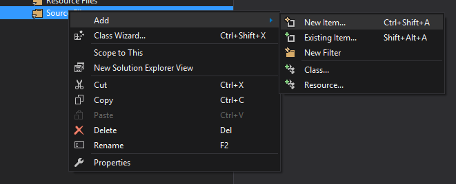

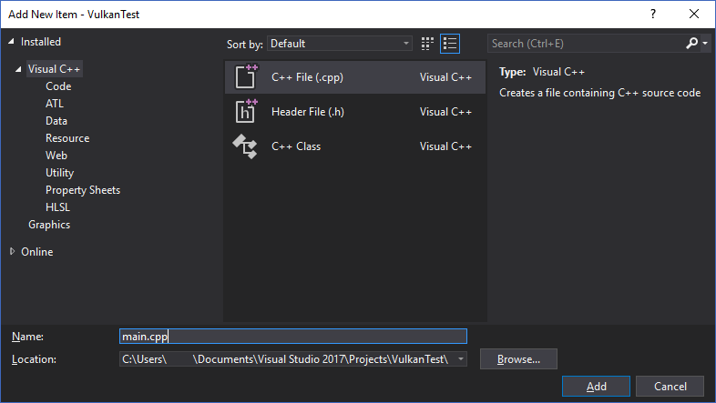

Добавьте в файл код, указанный ниже. Вам необязательно пытаться понять его сейчас, важно узнать, соберется ли и запустится ли программа. В следующей главе мы начнем описание с самых азов.

```cpp
#define GLFW_INCLUDE_VULKAN
#include <GLFW/glfw3.h>

#define GLM_FORCE_RADIANS
#define GLM_FORCE_DEPTH_ZERO_TO_ONE
#include <glm/vec4.hpp>
#include <glm/mat4x4.hpp>

#include <iostream>

int main() {
    glfwInit();

    glfwWindowHint(GLFW_CLIENT_API, GLFW_NO_API);
    GLFWwindow* window = glfwCreateWindow(800, 600, "Vulkan window", nullptr, nullptr);

    uint32_t extensionCount = 0;
    vkEnumerateInstanceExtensionProperties(nullptr, &extensionCount, nullptr);

    std::cout << extensionCount << " extensions supported\n";

    glm::mat4 matrix;
    glm::vec4 vec;
    auto test = matrix * vec;

    while(!glfwWindowShouldClose(window)) {
        glfwPollEvents();
    }

    glfwDestroyWindow(window);

    glfwTerminate();

    return 0;
}
```

Откройте диалог с настройками проекта и убедитесь, что в меню выбрано `All Configurations`. Это нужно из-за того, что большинство настроек применяются как в режиме `Debug`, так и в `Release`. 


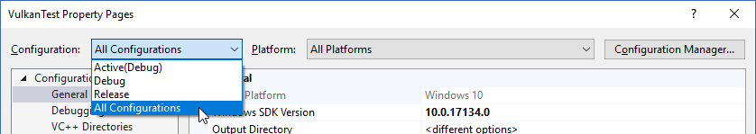

Перейдите в `C++ -> General -> Additional Include Directories` и выберите `<Edit...>` в выпадающем списке.

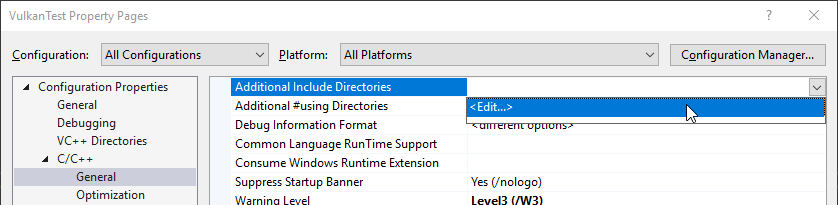

Добавьте include директории для Vulkan, GLFW и GLM:

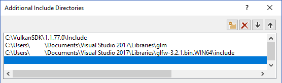

Перейдите в `Linker → General → Additional Library Directories` и добавьте расположения lib-файлов для Vulkan и GLFW:

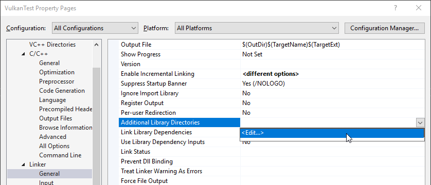

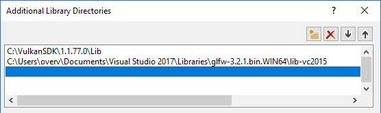

Перейдите в `Linker → Input` и выберите `Edit` в выпадающем списке `Additional Dependencies`.


Введите имена lib-файлов Vulkan и GLFW:


И измените настройки стандарта на C++:

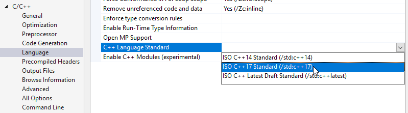

Теперь вы можете закрыть диалог с настройками проекта. Если все сделано верно, подсветки ошибок в коде больше не будет.

Не забудьте выбрать для компиляции 64-битный режим.

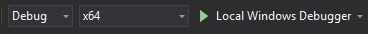

Нажмите F5, чтобы скомпилировать и запустить проект. Вы увидите командную строку и окно, подобное этому:

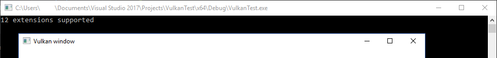

Проверьте, чтобы число расширений не равнялось нулю («X extensions supported» в консоли).

Поздравляем, вы готовы к работе с Vulkan! 

## Linux

Инструкции ниже предназначены для пользователей Ubuntu, но вы можете следовать им, изменив команды apt на подходящие вам команды менеджера пакетов. Вам нужен компилятор с поддержкой С++17 \(GCC 7+ или Clang 5+\). Вам также понадобится утилита make.

### Vulkan Packages

Самыми важными компонентами для разработки с использованием Vulkan под Linux являются загрузчик Vulkan, слои валидации и несколько утилит командной строки для проверки совместимости вашего компьютера с Vulkan:

- `sudo apt install vulkan-tools`: утилиты командной строки, особенно можно выделить `vulkaninfo` и `vkcube`. Запустите их, чтобы проверить, поддерживает ли ваш ПК Vulkan.
- `sudo apt install libvulkan-dev`: устанавливает загрузчик Vulkan. Загрузчик ищет методы драйвера в рантайме \(во время исполнения\) так же, как это делает библиотека GLEW для OpenGL.
- `sudo apt install vulkan-validationlayers-dev`: устанавливает стандартные слои валидации, которые необходимы при отладке программ с Vulkan. О них мы поговорим в следующей главе.

Также не забудьте запустить `vkcube`, после чего на экране должно появиться следующее:


Если вы получили сообщение об ошибке, убедитесь, что ваша видеокарта поддерживает Vulkan, а драйвер обновлен до последней версии. См. главу [Введение](../../part1/chapter1/text.md), в которой даны ссылки на драйверы крупных производителей.

### GLFW

Как уже было сказано, Vulkan – это API, независимый от платформы, в котором нет инструментов создания окна для отображения результатов рендеринга. Чтобы использовать преимущества кроссплатформенности Vulkan и избежать ужасов X11, мы будем использовать библиотеку [GLFW](https://www.glfw.org/) для создания окна. Есть и другие доступные библиотеки, например, [SDL](https://www.libsdl.org/), но GLFW лучше тем, что она абстрагирует не только создание окна, но и некоторые другие платформенно-зависимые функции.

Мы будем устанавливать GLFW с помощью следующей команды `sudo apt install libglfw3-dev`

### GLM

В отличие от DirectX 12, в Vulkan нет библиотеки для операций линейной алгебры, поэтому ее придется скачать отдельно. [GLM](https://glm.g-truc.net/0.9.9/index.html) – это удобная библиотека, разработанная для использования с графическими API, она часто используется с OpenGL.

Библиотека GLM – это header only библиотека. Ее можно установить из пакета `libglm-dev`: `sudo apt install libglm-dev`

### Компилятор шейдеров

Теперь, когда настройка почти завершена, осталось установить программу для компиляции шейдеров из [GLSL](https://en.wikipedia.org/wiki/OpenGL_Shading_Language) в байт-код.

Два наиболее известных компилятора шейдеров — это `glslangValidator` от Khronos Group и `glslc` от Google. По использованию `glslc` похож на GCC и Clang, поэтому мы остановим выбор на нем. Скачайте [бинарники](https://github.com/google/shaderc/blob/main/downloads.md) и скопируйте `glslc` в `/usr/local/bin`. Обратите внимание, что, в зависимости от ваших прав доступа, вам может понадобиться команда `sudo`. Для тестирования запустите `glslc`, после чего должно появиться предупреждение: `glslc: error: no input files`

Мы подробно рассмотрим `glslc` в главе о шейдерных модулях. 

### Настройка проекта для makefile

После установки всех библиотек мы можем настроить проект makefile для Vulkan и написать немного кода, чтобы убедиться, что все работает.

Создайте новую папку в удобном месте и назовите ее `VulkanTest`. Создайте файл с именем `main.cpp` и вставьте в него код, приведенный ниже. Вам необязательно пытаться понять его сейчас, важно узнать, соберется ли и запустится ли программа. В следующей главе мы начнем описание с самых азов. 

```cpp
#define GLFW_INCLUDE_VULKAN
#include <GLFW/glfw3.h>

#define GLM_FORCE_RADIANS
#define GLM_FORCE_DEPTH_ZERO_TO_ONE
#include <glm/vec4.hpp>
#include <glm/mat4x4.hpp>

#include <iostream>

int main() {
    glfwInit();

    glfwWindowHint(GLFW_CLIENT_API, GLFW_NO_API);
    GLFWwindow* window = glfwCreateWindow(800, 600, "Vulkan window", nullptr, nullptr);

    uint32_t extensionCount = 0;
    vkEnumerateInstanceExtensionProperties(nullptr, &extensionCount, nullptr);

    std::cout << extensionCount << " extensions supported\n";

    glm::mat4 matrix;
    glm::vec4 vec;
    auto test = matrix * vec;

    while(!glfwWindowShouldClose(window)) {
        glfwPollEvents();
    }

    glfwDestroyWindow(window);

    glfwTerminate();

    return 0;
}
```

Следующим шагом будет написание makefile для компиляции и запуска. Создайте новый пустой файл с именем `Makefile`. Предполагается, что у вас уже есть начальный опыт работы с makefiles. Если нет, то [это руководство](https://makefiletutorial.com/) поможет вам быстро войти в курс дела.

Сначала необходимо определить несколько переменных, чтобы упростить оставшуюся часть файла. Определите переменную `CFLAGS`, которая укажет базовые флаги компилятора:

```
CFLAGS = -std=c++17 -O2
```

Мы используем современный С++ \(`-std=c++17`\). Также мы задаем уровень оптимизации О2. Можно удалить уровень -О2 для более быстрой компиляции программ, но для релизной сборки его все равно нужно будет вернуть.

Аналогично определите базовые флаги линкера в переменной `LDFLAGS`:

```
LDFLAGS = -lglfw -lvulkan -ldl -lpthread -lX11 -lXxf86vm -lXrandr -lXi
```

Флаг `-lglfw` подключает библиотеку GLFW, `-lvulkan` — загрузчик Vulkan, а остальные флаги — низкоуровневые библиотеки и зависимости самой GLFW.

Теперь вам будет несложно определить правило для компиляции `VulkanTest`. Не забудьте, что для отступов необходимо использовать табы вместо пробелов.

```
VulkanTest: main.cpp
    g++ $(CFLAGS) -o VulkanTest main.cpp $(LDFLAGS)
```

Проверьте, работает ли сборка. Сохраните makefile и запустите `make` из папки с `main.cpp` и `Makefile`. В результате должен получиться исполняемый файл `VulkanTest`.

Теперь необходимо задать еще два правила — `test` и `clean`. Test запускает исполняемый файл, а clean удаляет его.

```
.PHONY: test clean

test: VulkanTest
    ./VulkanTest

clean:
    rm -f VulkanTest
```

Запуск команды `make test` позволит убедиться, что программа работает успешно. При закрытии пустого окна программа должна завершиться успешным кодом возврата \(0\). У вас должен получиться готовый makefile, похожий на приведенный ниже:

```
CFLAGS = -std=c++17 -O2
LDFLAGS = -lglfw -lvulkan -ldl -lpthread -lX11 -lXxf86vm -lXrandr -lXi

VulkanTest: main.cpp
    g++ $(CFLAGS) -o VulkanTest main.cpp $(LDFLAGS)

.PHONY: test clean

test: VulkanTest
	./VulkanTest

clean:
    rm -f VulkanTest
```

Вы можете использовать эту структуру каталогов в качестве шаблона для проектов Vulkan. Для этого скопируйте ее, переименуйте, например, в `HelloTriangle` и удалите весь код из `main.cpp`.

Итак, теперь вы готовы к настоящему приключению. 

## MacOS

Инструкции ниже предназначены для тех, кто использует Xcode и менеджер пакетов [Homebrew](https://brew.sh/). Имейте в виду, что версия MacOS не должна быть ниже 10.11, а ваше устройство должно поддерживать [Metal API](https://en.wikipedia.org/wiki/Metal_(API)#Supported_GPUs).

### Vulkan SDK

Самым важным компонентом для разработки программ с Vulkan является SDK. Он включает в себя заголовочные файлы, стандартные слои валидации, инструменты отладки и загрузчик функций Vulkan. Загрузчик ищет методы драйвера в рантайме \(во время исполнения\) так же, как это делает библиотека GLEW для OpenGL.

SDK можно загрузить с сайта [LunarG](https://vulkan.lunarg.com/). Для этого используйте кнопки внизу страницы. Вам необязательно создавать аккаунт, однако с ним у вас будет доступ к дополнительной документации.


Версия SDK для MacOS использует библиотеку [MoltenVK](https://moltengl.com/). MacOS не имеет прямой поддержки Vulkan, а MoltenVK используется как прослойка для передачи вызовов в Apple Metal. Благодаря этому вы можете воспользоваться преимуществами отладки и производительности Apple Metal.

После загрузки MoltenVK извлеките содержимое в любую папку \(имейте в виду, что вам необходимо будет ссылаться на нее при создании проекта в Xcode\). Внутри извлеченной папки, в папке `Applications`, должны находиться исполняемые файлы, которые позволят запустить несколько демо-проектов с использованием SDK. Запустите исполняемый файл `vkcube`, и вы увидите следующее:


### GLFW

Как уже было сказано, Vulkan – это API, независимый от платформы, в котором нет инструментов создания окна для отображения результатов рендеринга. Мы будем использовать библиотеку [GLFW](https://www.glfw.org/) для создания окна. Есть и другие доступные библиотеки, например, [SDL](https://www.libsdl.org/), но GLFW лучше тем, что она абстрагирует не только создание окна, но и некоторые другие платформенно-зависимые функции.

Для установки GLFW на MacOS мы будем использовать менеджер пакетов Homebrew: `brew install glfw`

### GLM

В Vulkan нет библиотеки для операций линейной алгебры, поэтому ее придется скачать отдельно. [GLM](https://glm.g-truc.net/0.9.9/index.html) – это удобная библиотека, разработанная для использования с графическими API, она часто используется с OpenGL.

Библиотека GLM – это header only библиотека. Ее можно установить из пакета glm: `brew install glm`

### Настройка Xcode

После установки всех библиотек мы можем настроить проект Xcode для Vulkan. Всякий раз при упоминании папки `vulkansdk`, мы будем иметь в виду папку, в которую вы извлекли Vulkan SDK.

Запустите Xcode и создайте новый проект Xcode. В появившемся окне выберите Application > Command Line Tool. 

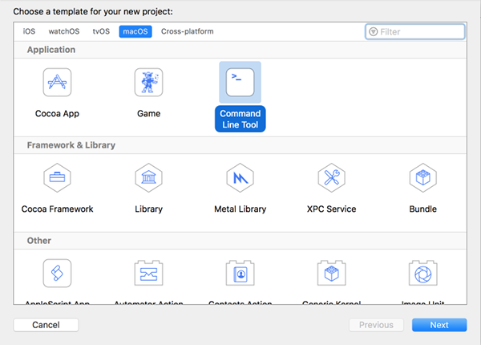

Выберите `Next`, введите имя проекта и в пункте `Language` выберите `C++`.

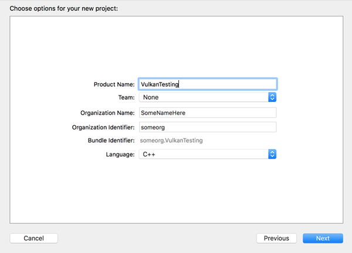

Нажмите `Next`, чтобы создать проект \(*в актуальном XCode12 вам потребуется ещё выбрать место для папки проекта — Прим. пер.*\). Когда проект будет создан, измените код в файле `main.cpp` на следующий: 

```cpp
#define GLFW_INCLUDE_VULKAN
#include <GLFW/glfw3.h>

#define GLM_FORCE_RADIANS
#define GLM_FORCE_DEPTH_ZERO_TO_ONE
#include <glm/vec4.hpp>
#include <glm/mat4x4.hpp>

#include <iostream>

int main() {
    glfwInit();

    glfwWindowHint(GLFW_CLIENT_API, GLFW_NO_API);
    GLFWwindow* window = glfwCreateWindow(800, 600, "Vulkan window", nullptr, nullptr);

    uint32_t extensionCount = 0;
    vkEnumerateInstanceExtensionProperties(nullptr, &extensionCount, nullptr);

    std::cout << extensionCount << " extensions supported\n";

    glm::mat4 matrix;
    glm::vec4 vec;
    auto test = matrix * vec;

    while(!glfwWindowShouldClose(window)) {
        glfwPollEvents();
    }

    glfwDestroyWindow(window);

    glfwTerminate();

    return 0;
}
```

Имейте в виду, вам необязательно пытаться понять весь код сейчас. Мы просто хотим использовать некоторые вызовы API, чтобы убедиться, что все работает правильно.

Xcode покажет некоторые ошибки, например, библиотеки, которые не были найдены. Необходимо настроить проект так, чтобы устранить эти ошибки. Выберите ваш проект в панели *Project Navigator*. Откройте вкладку *Build Settings* и выполните следующее:

- Найдите поле **Header Search Paths** и добавьте ссылку на `/usr/local/include` \(это место, куда Homebrew устанавливает заголовочные файлы, поэтому здесь должны быть файлы glm и glfw3\) и ссылку на `vulkansdk/macOS/include` для заголовочных файлов Vulkan.
- Найдите поле **Library Search Paths** и добавьте ссылку на `/usr/local/lib` \(это еще одно место, куда Homebrew устанавливает библиотечные файлы, поэтому здесь должны быть файлы glm и glfw3\) и ссылку на `vulkansdk/macOS/lib`.


В результате у вас должно получиться следующее (разумеется, пути будут отличаться в зависимости от расположения ваших файлов):

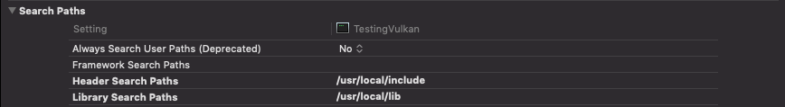

*\(На скриншоте на каждый параметр приходится по одному пути. Но, если следовать этому мануалу, вы получите по два пути на параметр. — Прим. пер.\)*

Теперь перейдем во вкладку *Build Phases* → **Link Binary With Libraries** и добавим фреймворки `glfw3` и `vulkan`. Чтобы упростить задачу, мы будем добавлять в проект динамические библиотеки (если вы хотите использовать статические библиотеки, вы можете изучить документацию к ним).

- Для glfw откройте папку `/usr/local/lib` \(*для этого вызовите Spotlight – Command+Space и введите в строку поиска /usr/local/lib – Прим. пер.*\), где вы найдете файл с именем, похожим на `libglfw.3.x.dylib` \("x" — это номер версии библиотеки; он зависит от даты загрузки пакета из Homebrew\). Перетащите файл во вкладку Linked Frameworks and Libraries в Xcode.
- Для vulkan перейдите в `vulkansdk/macOS/lib`. Сделайте то же самое с файлами `libvulkan.1.dylib` и `libvulkan.1.x.xx.dylib` \(здесь "x" — это номер версии загруженного SDK\).

После добавления библиотек в той же вкладке **Copy Files** измените `Destination` на "Frameworks", очистите поле `Subpath` и уберите флажок напротив "Copy only when installing". Нажмите на "+" и добавьте все три фреймворка. \(*Также уберите флажок напротив Code Sign On Copy, если он там есть. — Прим. пер.*\)

Конфигурация Xcode должна иметь следующий вид:


Осталось настроить несколько переменных среды. В панели инструментов Xcode перейдите в `Product` > `Scheme` > `Edit Scheme...` и во вкладке `Arguments` добавьте две переменные среды:

- VK_ICD_FILENAMES = `vulkansdk/macOS/share/vulkan/icd.d/MoltenVK_icd.json`
- VK_LAYER_PATH = `vulkansdk/macOS/share/vulkan/explicit_layer.d`

У вас должно получиться следующее: 


Итак, настройка завершена! После запуска проекта \(не забудьте установить конфигурацию сборки Debug или Release\) вы увидите следующее:

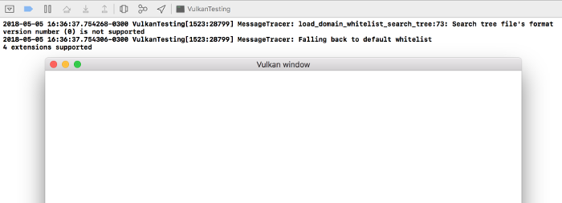

Число расширений должно быть больше нуля \("X extensions supported" в консоли\). Остальные логи берутся из библиотек. Вы можете получать разные сообщения в зависимости от вашей конфигурации.

Поздравляем! Теперь вы готовы к реальной работе с Vulkan.
