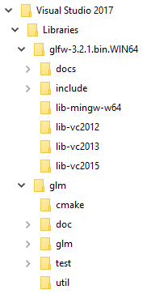
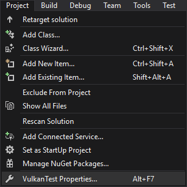
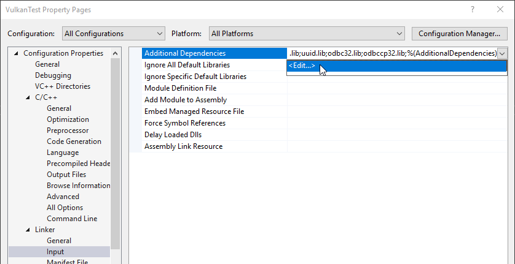

# Vulkan. Руководство разработчика. Настройка окружения

В этой главе мы настроим рабочую среду и установим несколько полезных библиотек. Инструменты, которые мы будем использовать, являются кроссплатформенными \(разумеется, за исключением компилятора\). Однако их установка в Windows, Linux и MacOS отличается, поэтому в руководстве каждая из этих ОС будет рассматриваться отдельно.

## Windows

Если вы занимаетесь разработкой для Windows, то, скорее всего, вы используете Visual Studio. Для полной поддержки С++17 необходимо использовать Visual Studio 2017 или 2019. Шаги, описанные ниже, подходят для VS 2017.

### Vulkan SDK

Самым важным компонентом для разработки программ с Vulkan является SDK. Он включает в себя заголовочные файлы, стандартные слои валидации, инструменты отладки и загрузчик функций Vulkan. Загрузчик ищет методы драйвера в рантайме \(во время исполнения\) так же, как это делает библиотека GLEW для OpenGL.

SDK можно загрузить с сайта [LunarG](http://vulkan.lunarg.com/). Для этого используйте кнопки внизу страницы. Вам необязательно создавать аккаунт, однако с ним у вас будет доступ к дополнительной документации.


Устанавливая SDK, запомните место установки.
Следующим шагом проверьте, поддерживает ли Vulkan ваша видеокарта и драйвер. Перейдите в папку с SDK, откройте папку `Bin` и запустите демо-проект `vkcube.exe`. Должно появиться следующее:


Если вы получили сообщение об ошибке, убедитесь, что ваша видеокарта поддерживает Vulkan, а драйвер обновлен до последней версии. См. главу [Введение](../../part1/chapter1/text.md), в которой даны ссылки на драйверы крупных производителей.

В этой папке есть и другие программы, которые могут оказаться полезными для разработки. Программы `glslangValidator.exe` и `glslc.exe` используются для компиляции шейдеров из [GLSL](https://en.wikipedia.org/wiki/OpenGL_Shading_Language) в байт-код. Подробно эта тема будет рассмотрена в главе [Шейдерные модули](https://vulkan-tutorial.com/Drawing_a_triangle/Graphics_pipeline_basics/Shader_modules). В папке `Bin` также находятся dll библиотеки загрузчика Vulkan и слоёв валидации, в папке `Lib` — статические библиотеки, а в папке `Include` – заголовочные файлы Vulkan. Вы можете изучить и другие файлы, но для руководства они нам не понадобятся.

### GLFW

Как уже было сказано, Vulkan – это API, независимый от платформы, в котором нет инструментов создания окна для отображения результатов рендеринга. Чтобы использовать преимущества кроссплатформенности Vulkan и избежать ужасов Win32, мы будем использовать библиотеку [GLFW](https://www.glfw.org/) для создания окна. Есть и другие доступные библиотеки, например, [SDL](https://www.libsdl.org/), но GLFW лучше тем, что она абстрагирует не только создание окна, но и некоторые другие платформенно-зависимые функции.

Последнюю версию библиотеки GLFW можно найти на [официальном сайте](https://www.glfw.org/download.html). В руководстве мы будем использовать 64-битные сборки, но вы, разумеется, можете выбрать и 32-битные. В этом случае убедитесь, что вы ссылаетесь на файлы Vulkan SDK в папке `Lib32`, а не в `Lib`. После скачивания распакуйте архив в удобное место. Мы создали новую папку `Libraries` в папке Visual Studio.


### GLM

В отличие от DirectX 12, в Vulkan нет библиотеки для операций линейной алгебры, поэтому ее придется скачать отдельно. [GLM](https://glm.g-truc.net/0.9.9/index.html) – это удобная библиотека, разработанная для использования с графическими API, она часто используется с OpenGL.

Библиотека GLM – это header only библиотека. Скачайте [последнюю версию](https://github.com/g-truc/glm/releases) и сохраните ее в удобном месте. У вас должна получиться подобная структура каталогов:



### Настройка Visual Studio

После установки всех библиотек мы можем настроить проект Visual Studio для Vulkan и написать немного кода, чтобы убедиться, что все работает.

Откройте Visual Studio и создайте новый проект `Windows Desktop Wizard`. Введите имя проекта и нажмите `OK`.


В поле `Application type` выберите `Console Application (.exe)`, чтобы видеть сообщения отладки. Также выберите `Empty Project`, чтобы Visual Studio не добавила шаблонный код.


Нажмите `OK`, чтобы создать проект, и добавьте .cpp файл. Наверняка вы и так знаете, как это сделать, но мы не стали пропускать эти действия, чтобы инструкция получилась полной.


Добавьте в файл код, указанный ниже. Вам необязательно пытаться понять его сейчас, важно узнать, соберется ли и запустится ли программа. В следующей главе мы начнем описание с самых азов.

```cpp
#define GLFW_INCLUDE_VULKAN
#include <GLFW/glfw3.h>

#define GLM_FORCE_RADIANS
#define GLM_FORCE_DEPTH_ZERO_TO_ONE
#include <glm/vec4.hpp>
#include <glm/mat4x4.hpp>

#include <iostream>

int main() {
    glfwInit();

    glfwWindowHint(GLFW_CLIENT_API, GLFW_NO_API);
    GLFWwindow* window = glfwCreateWindow(800, 600, "Vulkan window", nullptr, nullptr);

    uint32_t extensionCount = 0;
    vkEnumerateInstanceExtensionProperties(nullptr, &extensionCount, nullptr);

    std::cout << extensionCount << " extensions supported\n";

    glm::mat4 matrix;
    glm::vec4 vec;
    auto test = matrix * vec;

    while(!glfwWindowShouldClose(window)) {
        glfwPollEvents();
    }

    glfwDestroyWindow(window);

    glfwTerminate();

    return 0;
}
```

Откройте диалог с настройками проекта и убедитесь, что в меню выбрано `All Configurations`. Это нужно из-за того, что большинство настроек применяются как в режиме `Debug`, так и в `Release`. 




Перейдите в `C++ -> General -> Additional Include Directories` и выберите `<Edit...>` в выпадающем списке.


Добавьте include директории для Vulkan, GLFW и GLM:


Перейдите в `Linker → General → Additional Library Directories` и добавьте расположения lib-файлов для Vulkan и GLFW:


Перейдите в `Linker → Input` и выберите `Edit` в выпадающем списке `Additional Dependencies`.



Введите имена lib-файлов Vulkan и GLFW:


И измените настройки стандарта на C++:


Теперь вы можете закрыть диалог с настройками проекта. Если все сделано верно, подсветки ошибок в коде больше не будет.

Не забудьте выбрать для компиляции 64-битный режим.


Нажмите F5, чтобы скомпилировать и запустить проект. Вы увидите командную строку и окно, подобное этому:


Проверьте, чтобы число расширений не равнялось нулю («X extensions supported» в консоли).

Поздравляем, вы готовы к работе с Vulkan! 

