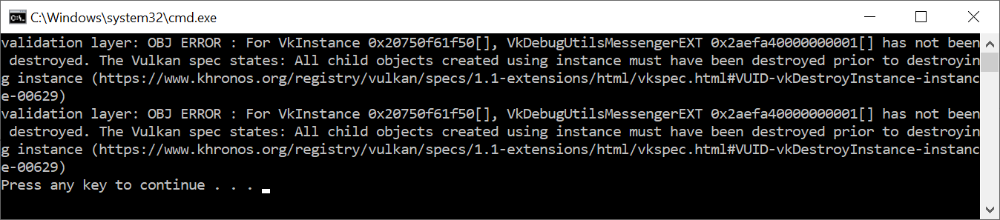

# Vulkan. Руководство разработчика. Слои валидации

## Что представляют собой слои валидации?

В основе разработки Vulkan API лежит идея минимальных нагрузок на драйвер, поэтому по умолчанию возможности обнаружения ошибок сильно ограничены. Даже такие простые ошибки, как некорректные значения в перечислениях или передача нулевых указателей, как правило, явно не обрабатываются и приводят к сбоям или неопределённому поведению. Поскольку для работы с Vulkan требуется подробно описывать каждое действие, подобные ошибки могут возникать довольно часто.

Для решения этой проблемы в Vulkan используются *слои валидации*. Слои валидации — это дополнительные компоненты, которые могут подключаются к вызовам функций для выполнения дополнительных операций. В слоях валидации могут выполняться следующие операции:

- Проверка значений параметров в соответствии со спецификацией для обнаружения ошибок
- Отслеживание утечки ресурсов
- Проверка потоковой безопасности
- Логирование каждого вызова и его параметров
- Отслеживание вызовов Vulkan для профилирования и воспроизведения

Ниже приведен пример того, как может быть реализована функция в слое валидации:

```cpp
VkResult vkCreateInstance(
    const VkInstanceCreateInfo* pCreateInfo,
    const VkAllocationCallbacks* pAllocator,
    VkInstance* instance) {

    if (pCreateInfo == nullptr || instance == nullptr) {
        log("Null pointer passed to required parameter!");
        return VK_ERROR_INITIALIZATION_FAILED;
    }

    return real_vkCreateInstance(pCreateInfo, pAllocator, instance);
}
```

Вы можете комбинировать слои валидации друг с другом, чтобы использовать все нужные вам функции отладки. Также слои валидации можно включать для отладочных сборок и полностью отключать для релизных сборок, что очень удобно.

У Vulkan нет встроенных слоев валидации, но Vulkan SDK от LunarG предоставляет хороший набор слоев для отслеживания самых частых ошибок. Все слои имеют открытый [исходный код](https://github.com/KhronosGroup/Vulkan-ValidationLayers), и вы всегда можете посмотреть, какие ошибки они отслеживают. Благодаря слоям валидации можно избежать ошибок на разных драйверах, связанных с неопределенным поведением.

Чтобы использовать слои валидации, их необходимо установить в систему. Например, слои валидации от LunarG доступны, только если установлен Vulkan SDK.

Раньше в Vulkan было два типа слоев валидации: для экземпляра \(instance\) и для конкретного устройства. Суть в том, что слои экземпляра проверяют вызовы, относящиеся к глобальным объектам Vulkan, а слои устройства проверяют только вызовы, относящиеся к конкретному GPU. На данный момент слои устройства устарели, поэтому слои валидации экземпляра применяются ко всем вызовам Vulkan. Спецификация по-прежнему рекомендует включать слои валидации на уровне устройства, в том числе для обеспечения совместимости, которая требуется для некоторых реализаций. Мы же укажем одинаковые слои для экземпляра и логического устройства, о котором узнаем немного позже.

## Использование слоев валидации

В этом разделе мы рассмотрим, как подключить слои, предоставляемые Vulkan SDK. Так же, как и для расширений, мы должны указать имена слоев для их подключения. Все полезные нам проверки собраны в слое с названием "`VK_LAYER_KHRONOS_validation`".

Добавим две конфигурационные константы. Первая \(validationLayers\) будет перечислять, какие именно слои валидации мы хотим подключить. Вторая \(enableValidationLayers\) будет разрешать подключение в зависимости от режима сборки. Макрос `NDEBUG` является частью стандарта C++ и обозначает "not debug".

```cpp
const uint32_t WIDTH = 800;
const uint32_t HEIGHT = 600;

const std::vector<const char*> validationLayers = {
    "VK_LAYER_KHRONOS_validation"
};

#ifdef NDEBUG
    const bool enableValidationLayers = false;
#else
    const bool enableValidationLayers = true;
#endif
```

Добавим новую функцию `checkValidationLayerSupport`, которая будет проверять, доступны ли все требуемые слои. Для начала получим список доступных слоев с помощью [vkEnumerateInstanceLayerProperties](https://www.khronos.org/registry/vulkan/specs/1.2-extensions/man/html/vkEnumerateInstanceLayerProperties.html). Ее использование аналогично функции [vkEnumerateInstanceExtensionProperties](https://www.khronos.org/registry/vulkan/specs/1.2-extensions/man/html/vkEnumerateInstanceExtensionProperties.html), которую мы рассматривали ранее.

```cpp
bool checkValidationLayerSupport() {
    uint32_t layerCount;
    vkEnumerateInstanceLayerProperties(&layerCount, nullptr);

    std::vector<VkLayerProperties> availableLayers(layerCount);
    vkEnumerateInstanceLayerProperties(&layerCount, availableLayers.data());

    return false;
```

После этого проверим, все ли слои из `validationLayers` присутствуют в `availableLayers`. Возможно, вам понадобится подключить `<cstring>` для `strcmp`.

```cpp
for (const char* layerName : validationLayers) {
    bool layerFound = false;

    for (const auto& layerProperties : availableLayers) {
        if (strcmp(layerName, layerProperties.layerName) == 0) {
            layerFound = true;
            break;
        }
    }

    if (!layerFound) {
        return false;
    }
}

return true;
```

Теперь функцию можно использовать в `createInstance`:

```cpp
void createInstance() {
    if (enableValidationLayers && !checkValidationLayerSupport()) {
        throw std::runtime_error("validation layers requested, but not available!");
    }

    ...
}
```

Запустите программу в режиме отладки и проследите, чтобы не было ошибок.

В структуре [VkInstanceCreateInfo](https://www.khronos.org/registry/vulkan/specs/1.2-extensions/man/html/VkInstanceCreateInfo.html) укажите имена подключенных слоев валидации:

```cpp
if (enableValidationLayers) {
    createInfo.enabledLayerCount = static_cast<uint32_t>(validationLayers.size());
    createInfo.ppEnabledLayerNames = validationLayers.data();
} else {
    createInfo.enabledLayerCount = 0;
}
```

Если наша проверка была пройдена, [vkCreateInstance](https://www.khronos.org/registry/vulkan/specs/1.2-extensions/man/html/vkCreateInstance.html) не должен вернуть ошибку `VK_ERROR_LAYER_NOT_PRESENT`, но лучше убедиться в этом, запустив программу.

## Перехват отладочных сообщений

По умолчанию слои валидации отправляют отладочные сообщения в стандартный вывод, но вы можете обрабатывать их самостоятельно, предоставляя callback-функцию. Это позволит вам фильтровать сообщения, которые вы хотели бы получать, поскольку не все они содержат предупреждение об ошибках. Если вы хотите пропустить этот шаг, перейдите сразу к последнему разделу главы.

Чтобы подключить callback-функцию для обработки сообщений, нужно настроить отладочный мессенджер, используя расширение `VK_EXT_debug_utils`.

Для начала добавим функцию `getRequiredExtensions`, которая будет возвращать требуемый список расширений в зависимости от того, подключены слои валидации или нет.

```cpp
std::vector<const char*> getRequiredExtensions() {
    uint32_t glfwExtensionCount = 0;
    const char** glfwExtensions;
    glfwExtensions = glfwGetRequiredInstanceExtensions(&glfwExtensionCount);

    std::vector<const char*> extensions(glfwExtensions, glfwExtensions + glfwExtensionCount);

    if (enableValidationLayers) {
        extensions.push_back(VK_EXT_DEBUG_UTILS_EXTENSION_NAME);
    }

    return extensions;
}
```

Расширения GLFW являются обязательными, а расширение отладочного мессенджера добавляется в зависимости от условий. Обратите внимание, что мы используем макрос `VK_EXT_DEBUG_UTILS_EXTENSION_NAME`, который позволяет избежать опечаток. 

Теперь мы можем использовать эту функцию в createInstance:

```cpp
auto extensions = getRequiredExtensions();
createInfo.enabledExtensionCount = static_cast<uint32_t>(extensions.size());
createInfo.ppEnabledExtensionNames = extensions.data();
```

Запустите программу, чтобы проверить, не получили ли мы ошибку `VK_ERROR_EXTENSION_NOT_PRESENT`.

Теперь посмотрим, что собой представляет сама callback-функция. Добавим новый статический метод с прототипом `PFN_vkDebugUtilsMessengerCallbackEXT`. `VKAPI_ATTR` и `VKAPI_CALL` позволяют убедиться, что метод имеет правильную сигнатуру.

```cpp
static VKAPI_ATTR VkBool32 VKAPI_CALL debugCallback(
    VkDebugUtilsMessageSeverityFlagBitsEXT messageSeverity,
    VkDebugUtilsMessageTypeFlagsEXT messageType,
    const VkDebugUtilsMessengerCallbackDataEXT* pCallbackData,
    void* pUserData) {

    std::cerr << "validation layer: " << pCallbackData->pMessage << std::endl;

    return VK_FALSE;
}
```

Первый параметр определяет степень серьезности сообщения, которые бывают:

- `VK_DEBUG_UTILS_MESSAGE_SEVERITY_VERBOSE_BIT_EXT`: диагностическое сообщение
- `VK_DEBUG_UTILS_MESSAGE_SEVERITY_INFO_BIT_EXT`: информационное сообщение, например, о создании ресурса
- `VK_DEBUG_UTILS_MESSAGE_SEVERITY_WARNING_BIT_EXT`: сообщение о поведении, которое не обязательно является некорректным, но вероятнее всего указывает на ошибку
- `VK_DEBUG_UTILS_MESSAGE_SEVERITY_ERROR_BIT_EXT`: сообщение о некорректном поведении, которое может привести к сбою


Значения для перечисления выбраны таким образом, что вы можете использовать операцию сравнения, чтобы отсеять сообщения выше или ниже какого-то порога, например:

```cpp
if (messageSeverity >= VK_DEBUG_UTILS_MESSAGE_SEVERITY_WARNING_BIT_EXT) {
    // Message is important enough to show
}
```

Параметр messageType может иметь следующие значения:

- `VK_DEBUG_UTILS_MESSAGE_TYPE_GENERAL_BIT_EXT`: произошедшее событие не связано со спецификацией или производительностью
- `VK_DEBUG_UTILS_MESSAGE_TYPE_VALIDATION_BIT_EXT`: произошедшее событие нарушает спецификацию или указывает на возможную ошибку
- `VK_DEBUG_UTILS_MESSAGE_TYPE_PERFORMANCE_BIT_EXT`: возможно неоптимальное использование Vulkan


Параметр `pCallbackData` ссылается к структуре `VkDebugUtilsMessengerCallbackDataEXT`, которая содержит детали сообщения. Наиболее важными членами структуры являются:

- `pMessage`: отладочное сообщение в виде строки с завершающим нулем
- `pObjects`: массив дескрипторов объектов, относящихся к сообщению
- `objectCount`: количество объектов в массиве

Параметр `pUserData` содержит указатель, переданный во время настройки callback-функции.

Callback-функция возвращает `VkBool32` тип. Результат указывает, нужно ли прервать вызов, создавший сообщение. Если callback-функция возвращает `VK_TRUE`, вызов прерывается и возвращается код ошибки `VK_ERROR_VALIDATION_FAILED_EXT`. Как правило, это происходит только при тестировании самих слоев валидации, в нашем же случае нужно вернуть `VK_FALSE`.

Осталось сообщить Vulkan о callback-функции. Что удивительно, даже для управления отладочной callback-функцией в Vulkan требуется дескриптор, который нужно явно создать и уничтожить. Такая callback-функция является частью *отладочного мессенджера*, и их количество неограниченно. Добавьте член класса для дескриптора после `instance`:

```cpp
VkDebugUtilsMessengerEXT debugMessenger;
```

Теперь добавьте функцию `setupDebugMessenger`, которая будет вызвана из `initVulkan` сразу после `createInstance`:

```cpp
void initVulkan() {
    createInstance();
    setupDebugMessenger();
}

void setupDebugMessenger() {
    if (!enableValidationLayers) return;

}
```

Нам необходимо заполнить структуру деталями о мессенджере и его callback-функции:

```cpp
VkDebugUtilsMessengerCreateInfoEXT createInfo{};
createInfo.sType = VK_STRUCTURE_TYPE_DEBUG_UTILS_MESSENGER_CREATE_INFO_EXT;
createInfo.messageSeverity = VK_DEBUG_UTILS_MESSAGE_SEVERITY_VERBOSE_BIT_EXT | VK_DEBUG_UTILS_MESSAGE_SEVERITY_WARNING_BIT_EXT | VK_DEBUG_UTILS_MESSAGE_SEVERITY_ERROR_BIT_EXT;
createInfo.messageType = VK_DEBUG_UTILS_MESSAGE_TYPE_GENERAL_BIT_EXT | VK_DEBUG_UTILS_MESSAGE_TYPE_VALIDATION_BIT_EXT | VK_DEBUG_UTILS_MESSAGE_TYPE_PERFORMANCE_BIT_EXT;
createInfo.pfnUserCallback = debugCallback;
createInfo.pUserData = nullptr; // Optional
```

Поле `messageSeverity` позволяет задать степени серьезности, для которых будет вызываться callback-функция. Мы задаем все степени, кроме `VK_DEBUG_UTILS_MESSAGE_SEVERITY_INFO_BIT_EXT`, чтобы получать уведомления о возможных проблемах и не захламлять консоль подробной отладочной информацией.

Подобным образом поле `messageType` позволяет отфильтровать сообщения по типу. Мы выбрали все типы, но вы всегда можете отключить ненужные.

В поле `pfnUserCallback` передается указатель на callback-функцию. При желании вы можете передать указатель в поле `pUserData`, он будет передан в callback-функцию через параметр `pUserData`.

Обратите внимание, что есть и другие способы настроить сообщения слоев валидации и отладочные callback-функции, но наш способ лучше всего подходит для начала работы с Vulkan. Чтобы больше узнать о других способах, обратитесь к [спецификации расширения](https://www.khronos.org/registry/vulkan/specs/1.1-extensions/html/vkspec.html#VK_EXT_debug_utils).

Структуру необходимо передать в функцию `vkCreateDebugutilsMessengerEXT` для создания объекта `VkDebugUtilsMessengerEXT`. Это функция расширения, поэтому она не загружается автоматически. Вам нужно самим найти ее адрес, используя [vkGetInstanceProcAddr](https://www.khronos.org/registry/vulkan/specs/1.2-extensions/man/html/vkGetInstanceProcAddr.html). Мы создадим собственную прокси-функцию, которая сделает это внутри себя. Добавьте ее до определения класса `HelloTriangleApplication`.

```cpp
VkResult CreateDebugUtilsMessengerEXT(VkInstance instance, const VkDebugUtilsMessengerCreateInfoEXT* pCreateInfo, const VkAllocationCallbacks* pAllocator, VkDebugUtilsMessengerEXT* pDebugMessenger) {
    auto func = (PFN_vkCreateDebugUtilsMessengerEXT) vkGetInstanceProcAddr(instance, "vkCreateDebugUtilsMessengerEXT");
    if (func != nullptr) {
        return func(instance, pCreateInfo, pAllocator, pDebugMessenger);
    } else {
        return VK_ERROR_EXTENSION_NOT_PRESENT;
    }
}
```

Используем эту функцию для создания мессенджера:

```cpp
if (CreateDebugUtilsMessengerEXT(instance, &createInfo, nullptr, &debugMessenger) != VK_SUCCESS) {
    throw std::runtime_error("failed to set up debug messenger!");
}
```

Предпоследний параметр необязательный, это callback-функция аллокатора, которую мы укажем как `nullptr`. Остальные параметры довольно просты. Поскольку мессенджер используется для конкретного экземпляра Vulkan \(и его слоев валидации\), то указатель на этот экземпляр необходимо передать первым аргументом. Этот паттерн нам еще встретится для других дочерних объектов.

Объект `VkDebugUtilsMessengerEXT` должен быть уничтожен с помощью вызова `vkDestroyDebugUtilsMessengerEXT`. Так же как и для `vkCreateDebugUtilsMessengerEXT`, мы должны загрузить эту функцию явно.

После `CreateDebugUtilsMessengerEXT` создайте другую прокси-функцию:

```cpp
void DestroyDebugUtilsMessengerEXT(VkInstance instance, VkDebugUtilsMessengerEXT debugMessenger, const VkAllocationCallbacks* pAllocator) {
    auto func = (PFN_vkDestroyDebugUtilsMessengerEXT) vkGetInstanceProcAddr(instance, "vkDestroyDebugUtilsMessengerEXT");
    if (func != nullptr) {
        func(instance, debugMessenger, pAllocator);
    }
}
```

Проверьте, чтобы эта функция была либо статической функцией класса, либо функцией вне класса. После этого ее можно вызвать в функции `cleanup`:

```cpp
void cleanup() {
    if (enableValidationLayers) {
        DestroyDebugUtilsMessengerEXT(instance, debugMessenger, nullptr);
    }

    vkDestroyInstance(instance, nullptr);

    glfwDestroyWindow(window);

    glfwTerminate();
}
```

## Отладочный экземпляр Vulkan \(debugging instance\)

Мы с вами добавили отладку с помощью слоев валидации, но осталось еще кое-что. Для вызова `vkCreateDebugUtilsMessengerEXT` нужен валидный экземпляр, а `vkDestroyDebugUtilsMessengerEXT` необходимо вызвать до уничтожения экземпляра. Поэтому мы пока не можем выполнить отладку в [vkCreateInstance](https://www.khronos.org/registry/vulkan/specs/1.2-extensions/man/html/vkCreateInstance.html) и [vkDestroyInstance](https://www.khronos.org/registry/vulkan/specs/1.2-extensions/man/html/vkDestroyInstance.html).

Однако, если вы внимательно прочтете [спецификацию](https://github.com/KhronosGroup/Vulkan-Docs/blob/master/appendices/VK_EXT_debug_utils.txt#L120), вы увидите, что можно создать отдельный отладочный мессенджер для этих двух функций. Для этого необходимо установить указатель `pNext` структуры [VkInstanceCreateInfo](https://www.khronos.org/registry/vulkan/specs/1.2-extensions/man/html/VkInstanceCreateInfo.html) на структуру `VkDebugUtilsMessengerCreateInfoEXT`. Для начала вынесем заполнение `VkDebugUtilsMessengerCreateInfoEXT` в отдельный метод: 

```cpp
void populateDebugMessengerCreateInfo(VkDebugUtilsMessengerCreateInfoEXT& createInfo) {
    createInfo = {};
    createInfo.sType = VK_STRUCTURE_TYPE_DEBUG_UTILS_MESSENGER_CREATE_INFO_EXT;
    createInfo.messageSeverity = VK_DEBUG_UTILS_MESSAGE_SEVERITY_VERBOSE_BIT_EXT | VK_DEBUG_UTILS_MESSAGE_SEVERITY_WARNING_BIT_EXT | VK_DEBUG_UTILS_MESSAGE_SEVERITY_ERROR_BIT_EXT;
    createInfo.messageType = VK_DEBUG_UTILS_MESSAGE_TYPE_GENERAL_BIT_EXT | VK_DEBUG_UTILS_MESSAGE_TYPE_VALIDATION_BIT_EXT | VK_DEBUG_UTILS_MESSAGE_TYPE_PERFORMANCE_BIT_EXT;
    createInfo.pfnUserCallback = debugCallback;
}

...

void setupDebugMessenger() {
    if (!enableValidationLayers) return;

    VkDebugUtilsMessengerCreateInfoEXT createInfo;
    populateDebugMessengerCreateInfo(createInfo);

    if (CreateDebugUtilsMessengerEXT(instance, &createInfo, nullptr, &debugMessenger) != VK_SUCCESS) {
        throw std::runtime_error("failed to set up debug messenger!");
    }
}
```

Мы можем повторно использовать ее в функции `createInstance`:

```cpp
void createInstance() {
    ...

    VkInstanceCreateInfo createInfo{};
    createInfo.sType = VK_STRUCTURE_TYPE_INSTANCE_CREATE_INFO;
    createInfo.pApplicationInfo = &appInfo;

    ...

    VkDebugUtilsMessengerCreateInfoEXT debugCreateInfo;
    if (enableValidationLayers) {
        createInfo.enabledLayerCount = static_cast<uint32_t>(validationLayers.size());
        createInfo.ppEnabledLayerNames = validationLayers.data();

        populateDebugMessengerCreateInfo(debugCreateInfo);
        createInfo.pNext = (VkDebugUtilsMessengerCreateInfoEXT*) &debugCreateInfo;
    } else {
        createInfo.enabledLayerCount = 0;

        createInfo.pNext = nullptr;
    }

    if (vkCreateInstance(&createInfo, nullptr, &instance) != VK_SUCCESS) {
        throw std::runtime_error("failed to create instance!");
    }
}
```

Переменная `debugCreateInfo` находится за пределами оператора if, чтобы она не была уничтожена до вызова [vkCreateInstance](https://www.khronos.org/registry/vulkan/specs/1.2-extensions/man/html/vkCreateInstance.html). Создание дополнительного отладочного мессенджера таким способом позволяет автоматически использовать его в [vkCreateInstance](https://www.khronos.org/registry/vulkan/specs/1.2-extensions/man/html/vkCreateInstance.html) и [vkDestroyInstance](https://www.khronos.org/registry/vulkan/specs/1.2-extensions/man/html/vkDestroyInstance.html), после чего он будет уничтожен. 

## Тестирование

Давайте умышленно сделаем ошибку, чтобы увидеть слои валидации в действии.
Временно удалите вызов `DestroyDebugUtilsMessengerEXT` в функции `cleanup` и запустите программу. На выходе у вас должно получиться что-то подобное:



Чтобы узнать, какой вызов привел к отправке сообщения, добавьте точку останова в callback-функцию сообщения и посмотрите стек вызовов.

## Настройки

Существует гораздо больше настроек, определяющих поведение уровней валидации, помимо тех, что указываются в структуре `VkDebugUtilsMessengerCreateInfoEXT`. Перейдите в Vulkan SDK и откройте каталог `Config`. Там вы найдете файл `vk_layer_settings.txt`, в котором дается объяснение, как настраивать слои.

Для настройки слоев скопируйте файл в каталог `Debug` и `Release` и следуйте инструкциям, чтобы настроить желаемое поведение. Однако далее в руководстве будет подразумеваться, что вы используете настройки по умолчанию.

В дальнейшем мы умышленно будем делать ошибки, чтобы показать вам, на сколько удобно и эффективно использовать слои валидации для их отслеживания.

[Код C++](02_validation_layers.cpp)
