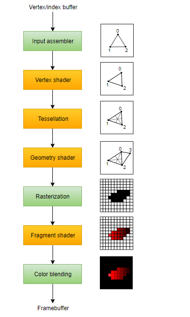
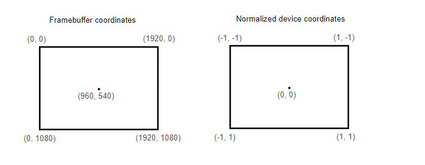
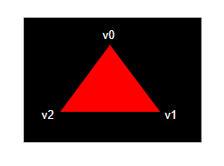

# Vulkan. Руководство разработчика. Графический конвейер

## Вступление

В течение следующих нескольких глав мы будем настраивать графический конвейер, который позволит нам нарисовать первый треугольник. Графический конвейер — это последовательность операций, которые преобразуют вершины и текстуры мешей в пиксели в render target-ах.

Ниже представлена упрощенная схема:



*Input assembler* собирает сырые данные вершин из буферов. На этом этапе также может использоваться индексный буфер, который избавляет от необходимости дублировать данные вершин для повторяющихся элементов.

*Вершинный шейдер \(vertex shader\)* вызывается для каждой вершины и используется, в основном, для трансформации вершин из локальной системы координат в экранную. Также он передает данные каждой вершины далее по конвейеру.

*Шейдеры тесселяции \(tessellation shaders\)* позволяют увеличить количество мешей за счет дополнительного разбиения геометрии. Их часто используют, чтобы сделать близлежащие поверхности, например, кирпичные стены или лестницы, менее плоскими.

*Геометрический шейдер \(geometry shader\)* вызывается для каждого примитива \(треугольник, линия, точка\) и может отменить их отрисовку или сгенерировать новые примитивы. Геометрический шейдер похож на шейдер тесселяции, только, в отличие от него, более гибкий. Однако он не часто используется в современных приложениях из-за недостаточно высокой производительности большинства видеокарт, за исключением встроенных графических процессоров Intel.

На этапе *растеризации \(rasterization\)* каждый примитив раскладывается на множество фрагментов. Фрагменты — это пиксельные элементы, которые заполняют примитивы во фреймбуфере. Все фрагменты, которые выходят за пределы экрана, отсекаются, а атрибуты, переданные вершинным шейдером, интерполируются по фрагментам, как показано на рисунке. Фрагменты, находящиеся за другими фрагментами, как правило, тоже отсекаются из-за теста глубины \(depth testing\).

*Фрагментный шейдер \(fragment shader\)* вызывается для каждого фрагмента и определяет, в какие фреймбуферы и с каким значением цвета и глубины записываются фрагменты. Для этого он использует интерполированные данные из вершинного шейдера, такие как текстурные координаты и нормали для освещения.

На этапе *смешивания цветов \(color blending\)* происходит смешивание различных фрагментов, относящихся к одному и тому же пикселю во фреймбуфере. Фрагменты могут перекрывать друг друга или смешиваться в зависимости от прозрачности.

Этапы, выделенные зеленым цветом, называются *непрограммируемыми \(fixed-function\)*. На этих этапах вы можете корректировать операции с помощью параметров, но принцип их работы определен заранее.

Этапы, выделенные оранжевым цветом, — *программируемые этапы \(programmable\)*. Это значит, что вы можете загрузить свой собственный код на видеокарту, чтобы выполнить необходимые операции. Это позволяет вам использовать, например, фрагментные шейдеры для самых разных задач от текстурирования и освещения до трассировки лучей. Эти программы запускаются одновременно на множестве ядер GPU для параллельной обработки таких объектов как вершины и фрагменты.

Если ранее вы работали с OpenGL или Direct3D, вы, вероятно, привыкли, что можете изменять любые настройки конвейера, когда это нужно, с помощью таких вызовов, как `glBlendFunc` и `OMSetBlendState`. В Vulkan же почти все настройки графического конвейера задаются заранее, поэтому вам придется полностью пересоздать конвейер, если вы захотите, например, переключить шейдер, привязать другой фреймбуфер или изменить функцию смешивания. Недостаток Vulkan в том, что нужно создавать несколько конвейеров, чтобы описать все комбинации состояний, которые вы хотите использовать в операциях отрисовки. Однако, поскольку все операции, которые вы будете выполнять в конвейере, известны заранее, у драйвера появляется больше возможностей для оптимизации.

Некоторые программируемые этапы можно пропустить. Например, вы можете отключить тесселяцию и геометрический шейдер, если рисуете простую геометрию. Если вас интересуют только значения глубины \(например, при создании [карты теней](https://en.wikipedia.org/wiki/Shadow_mapping)\), вы можете отключить фрагментный шейдер.

В следующей главе мы начнем с создания двух программируемых этапов, необходимых для отображения треугольника на экране: вершинного шейдера и фрагментного шейдера. Далее мы настроим непрограммируемые этапы, указав такие параметры, как режим смешивания и viewport. Заключительная часть создания графического конвейера включает настройку входных данных и выходных фреймбуферов.

Создайте функцию `createGraphicsPipeline`, которая вызывается сразу после `createImageViews` в `initVulkan`. Мы будем работать с ней в последующих главах.

```cpp
void initVulkan() {
    createInstance();
    setupDebugMessenger();
    createSurface();
    pickPhysicalDevice();
    createLogicalDevice();
    createSwapChain();
    createImageViews();
    createGraphicsPipeline();
}

...

void createGraphicsPipeline() {

}
```

[Код C++](08_graphics_pipeline.cpp)


## Шейдерные модули

В отличие от более ранних API шейдеры должны быть переданы в Vulkan в виде байт-кода, который называется SPIR-V. Он разработан для работы как с Vulkan, так и с OpenCL \(оба Khronos API\). [SPIR-V](https://www.khronos.org/spir/) можно использовать для создания графических и вычислительных шейдеров, но мы сосредоточимся только на шейдерах, используемых в графическом конвейере Vulkan.

Преимущество использования байт-кода в том, что компиляторы, написанные производителями GPU и компилирующие шейдеры в нативный код, получаются значительно проще. К тому же прошлое показало, что при использовании человеко-ориентированного синтаксиса, как GLSL, некоторые вендоры интерпретировали стандарт весьма свободно. При написании нетривиальных шейдеров для GPU такого производителя был большой риск, что код окажется несовместим с драйверами других производителей или, еще хуже, из-за ошибок компилятора шейдер будет работать иначе. Простой формат байт-кода SPIR-V позволяет избежать этих проблем.

Нам не придется писать байт-код вручную. Khronos выпустил собственный компилятор, независимый от производителя, который компилирует GLSL в SPIR-V. Он проверяет, соответствует ли шейдерный код стандарту, и создает бинарный файл SPIR-V для использования в вашей программе. Также этот компилятор можно использовать в качестве библиотеки для создания SPIR-V в рантайме \(во время исполнения\), но в руководстве мы не будем этого делать. Вместо `glslangValidator.exe` мы будем использовать `glslc.exe` от Google. Преимущество `glslc` в том, что он использует тот же формат командной строки, что и компиляторы GCC или Clang, и включает некоторые дополнительные функции, например, *includes*. Обе программы уже включены в Vulkan SDK, поэтому не нужно скачивать ничего дополнительно.

GLSL — это язык для программирования шейдеров, синтаксис которого базируется на языке C. Вместо использования параметров для входных данных и возвращаемого значения для выходных, GLSL использует глобальные переменные. В GLSL есть много фич, полезных при работе с графикой, например, встроенные векторные и матричные типы. Также доступны такие операции, как векторное произведение, умножение вектора на матрицу или отражение вектора от плоскости. Векторный тип обозначается как `vec` с числом, указывающим количество элементов. Так, например, 3D позиция может быть сохранена в vec3. Вы можете получить доступ к отдельным компонентам через такие элементы, как `.x`, либо создать новый вектор из нескольких компонентов одновременно. Например, результатом выражения `vec3(1.0, 2.0, 3.0).xy` будет `vec2`. Конструкторы векторов также могут принимать комбинации векторных объектов и скалярных значений. Например, `vec3` можно построить с помощью `vec3(vec2(1.0, 2.0), 3.0)`.

Как уже было сказано, для отрисовки треугольника мы должны написать вершинный шейдер и фрагментный шейдер. В следующих двух пунктах мы рассмотрим код GLSL для каждого шейдера и покажем, как создать бинарные файлы SPIR-V и загрузить их в программу.

### Вершинный шейдер

Вершинный шейдер обрабатывает каждую входящую вершину. В качестве входных данных он принимает вершинные атрибуты, такие как координаты в мировом пространстве, цвет, нормаль и текстурные координаты. Выходные данные — преобразованные координаты в пространстве отсечения \(clip space\) и атрибуты, которые передаются фрагментному шейдеру \(например, цвет и текстурные координаты\). Позже эти значения будут интерполированы по фрагментам для создания плавного градиента.

Координатами в пространстве отсечения называют четырехмерный вектор, принимаемый из вершинного шейдера, который преобразуется в нормализованные координаты устройства в результате деления вектора на его последний компонент. Нормализованные координаты устройства \(normalized device coordinate\) — это [гомогенные координаты](https://en.wikipedia.org/wiki/Homogeneous_coordinates), находящиеся в диапазоне \[-1, 1\], и проецирующиеся на фреймбуфер, как показано на картинке ниже:



Если до этого вы работали с OpenGL, вы можете заметить, что координата Y теперь зеркально отражена. А для координаты Z задан тот же диапазон, что и в Direct3D, от 0 до 1.

Для нашего первого треугольника мы не будем применять никаких преобразований, а просто укажем положения трех вершин в нормализованных координатах устройства для создания такой фигуры:



Мы можем отдавать непосредственно нормализованные координаты устройства, используя координаты пространства отсечения с единицей в качестве последнего компонента. Таким образом, деление на `w` не изменит значения координат при переходе от клип пространства к экранному.

Как правило, нормализированные координаты хранятся в вершинном буфере, но создание вершинного буфера в Vulkan и заполнение его данными — задача нетривиальная. Поэтому мы отложим это до тех пор, пока на экране не появится первый треугольник. А пока применим небольшую хитрость: вставим координаты непосредственно в вершинный шейдер. Код будет выглядеть так:

```glsl
#version 450

vec2 positions[3] = vec2[](
    vec2(0.0, -0.5),
    vec2(0.5, 0.5),
    vec2(-0.5, 0.5)
);

void main() {
    gl_Position = vec4(positions[gl_VertexIndex], 0.0, 1.0);
}
```

Функция `main` вызывается для каждой вершины. Встроенная переменная `gl_VertexIndex` содержит порядковый номер \(index\) текущей вершины. Обычно это номер вершины в вершинном буфере, но в нашем случае мы используем его для обращения во встроенный массив. Координаты `x` и `y`, полученные из массива, объединяются с константными `z` и `w`. В результате мы получаем координаты в пространстве отсечения. Встроенная переменная `gl_Position` используется в качестве выходной.

### Фрагментный шейдер

Вершины, полученные из вершинного шейдера, образуют треугольник, который должен быть заполнен фрагментами \(пикселами\) на экране. Фрагментный шейдер вызывается для каждого фрагмента и определяет его цвет и значение глубины во фреймбуфере \(или фреймбуферах\). Чтобы окрасить весь треугольник в красный цвет, используется простой фрагментный шейдер:

```glsl
#version 450
#extension GL_ARB_separate_shader_objects : enable

layout(location = 0) out vec4 outColor;

void main() {
    outColor = vec4(1.0, 0.0, 0.0, 1.0);
}
```

Функция `main` вызывается для каждого фрагмента. Для указания цвета в GLSL используются четырехкомпонентные RGBA-векторы с диапазоном от 0 до 1 для каждого канала. В отличие от вершинного шейдера, во фрагментном шейдере нет встроенной переменной для вывода цвета фрагмента. Вам нужно указать свою собственную выходную переменную для каждого фреймбуфера, где модификатор `layout (location = 0)` указывает номер фреймбуфера. В нашем случае в переменную `outColor`, которая связана с первым \(и единственным\) фреймбуфером с номером `0`, записывается красный цвет.

### Цвет каждой вершины

Полностью красный треугольник выглядит слишком просто, может, сделаем его поинтереснее?

Для этого внесём кое-какие изменения в оба шейдера. Сначала укажем цвет для каждой из трех вершин. Вершинный шейдер должен включать в себя массив цветов:

```glsl
vec3 colors[3] = vec3[](
    vec3(1.0, 0.0, 0.0),
    vec3(0.0, 1.0, 0.0),
    vec3(0.0, 0.0, 1.0)
);
```

Теперь нужно передать цвет каждой вершины во фрагментный шейдер, чтобы он мог вывести их интерполированные значения во фреймбуфер. Добавим выходную переменную для цвета в вершинный шейдер и заполним её в функции `main`:

```glsl
layout(location = 0) out vec3 fragColor;

void main() {
    gl_Position = vec4(positions[gl_VertexIndex], 0.0, 1.0);
    fragColor = colors[gl_VertexIndex];
}
```

Затем добавим соответствующую ему входную переменную во фрагментный шейдер:

```glsl
layout(location = 0) in vec3 fragColor;

void main() {
    outColor = vec4(fragColor, 1.0);
}
```

Входная и выходная переменная могут иметь разные имена — соответствие устанавливается с помощью номера, указанного в `location`. Как показано на изображении выше, значения `fragColor` будут автоматически интерполироваться по фрагментам между тремя вершинами для создания плавного градиента.

### Компиляция шейдеров

Создадим каталог с именем `shaders` в корневом каталоге проекта и сохраним вершинный шейдер в файл с именем `shader.vert`. Фрагментный шейдер сохраним в файл с именем `shader.frag`. Для шейдеров GLSL нет официального расширения, но чаще всего используются `.vert` и `.frag`.

Содержимое файла `shader.vert` должно быть следующим:

```glsl
#version 450
#extension GL_ARB_separate_shader_objects : enable

layout(location = 0) out vec3 fragColor;

vec2 positions[3] = vec2[](
    vec2(0.0, -0.5),
    vec2(0.5, 0.5),
    vec2(-0.5, 0.5)
);

vec3 colors[3] = vec3[](
    vec3(1.0, 0.0, 0.0),
    vec3(0.0, 1.0, 0.0),
    vec3(0.0, 0.0, 1.0)
);

void main() {
    gl_Position = vec4(positions[gl_VertexIndex], 0.0, 1.0);
    fragColor = colors[gl_VertexIndex];
}
```

А содержимое файла `shader.frag` следующим:

```glsl
#version 450
#extension GL_ARB_separate_shader_objects : enable

layout(location = 0) in vec3 fragColor;

layout(location = 0) out vec4 outColor;

void main() {
    outColor = vec4(fragColor, 1.0);
}
```

Теперь скомпилируем этот код в байт-код SPIR-V с помощью `glslc`.

<details>
 <summary>Windows</summary>

 Создайте файл `compile.bat`, который будет содержать следующее:

 ```
 C:/VulkanSDK/x.x.x.x/Bin32/glslc.exe shader.vert -o vert.spv
 C:/VulkanSDK/x.x.x.x/Bin32/glslc.exe shader.frag -o frag.spv
 pause
 ```

 Замените путь к `glslc.exe` на путь установки Vulkan SDK. Дважды щелкните по файлу, чтобы запустить его.
</details>

<details>
 <summary>Linux</summary>

 Создайте файл `compile.sh`, который будет содержать следующее:

 ```
 /home/user/VulkanSDK/x.x.x.x/x86_64/bin/glslc shader.vert -o vert.spv
 /home/user/VulkanSDK/x.x.x.x/x86_64/bin/glslc shader.frag -o frag.spv
 ```

 Замените путь к `glslc` на путь установки Vulkan SDK. Сделайте скрипт исполняемым с помощью команды `chmod + x compile.sh` и запустите его.
</details>

Эти две команды говорят компилятору прочитать исходный файл GLSL и вывести его в байт-код SPIR-V с помощью флага -o \(output\).

Если в вашем шейдере есть синтаксическая ошибка, компилятор сообщит вам номер строки и укажет на проблему. Чтобы в этом убедиться, попробуйте, например, убрать точку с запятой откуда-нибудь из текста шейдеров и по новой запустить скрипт. Также можете запустить компилятор без аргументов, чтобы узнать, какие типы флагов он поддерживает. Кроме того, компилятор может, например, вывести байт-код в формат удобный для чтения, чтобы вы могли посмотреть, что делает шейдер и какие оптимизации были выполнены на этом этапе.

Компиляция шейдеров в командной строке — один из самых простых способов, который мы будем использовать в руководстве, но вы можете скомпилировать шейдеры непосредственно из вашего кода. Для этого в Vulkan SDK есть [libshaderc](https://github.com/google/shaderc) — библиотека для компиляции кода GLSL в SPIR-V.

### Загрузка шейдера

Пришло время загрузить шейдеры SPIR-V в нашу программу, чтобы позже подключить к графическому конвейеру. Прежде всего напишем простую вспомогательную функцию для загрузки бинарных данных из файлов.

```cpp
#include <fstream>

...

static std::vector<char> readFile(const std::string& filename) {
    std::ifstream file(filename, std::ios::ate | std::ios::binary);

    if (!file.is_open()) {
        throw std::runtime_error("failed to open file!");
    }
}
```

Функция `readFile` будет считывать все байты из указанного файла и возвращать их в байтовом массиве, обернутом в `std::vector`. При открытии файла используем два флага:

- `ate`: установить указатель чтения на конец файла
- `binary`: читать файл как двоичный \(не использовать текстовые преобразования\)

Смысл установки указателя чтения на конец файла в том, что таким образом мы можем вычислить размер файла и заранее выделить память под буфер.

```cpp
size_t fileSize = (size_t) file.tellg();
std::vector<char> buffer(fileSize);
```

Затем мы можем вернуть указатель в начало файла и считать все байты за один вызов:

```cpp
file.seekg(0);
file.read(buffer.data(), fileSize);
```

И, наконец, закроем файл и возвратим буфер:

```cpp
file.close();

return buffer;
```

Теперь вызовем функцию `readFile` из `createGraphicsPipeline`, чтобы загрузить байт-код обоих шейдеров:

```cpp
void createGraphicsPipeline() {
    auto vertShaderCode = readFile("shaders/vert.spv");
    auto fragShaderCode = readFile("shaders/frag.spv");
}
```

Вы можете проверить, правильно ли загрузились файлы. Для этого можно напечатать в лог размер загруженных данных и сравнить с тем, что лежит на диске. Обратите внимание, что мы загружаем бинарные данные, а не текст, поэтому размер нельзя вычислять по нулевому байту в конце. Позже нам потребуется явно указывать размер полученных данных, и мы будем использовать для этого метод `size` контейнера `std::vector`.

### Создание шейдерных модулей

Прежде чем передать код конвейеру, мы должны обернуть его в [VkShaderModule](https://www.khronos.org/registry/vulkan/specs/1.2-extensions/man/html/VkShaderModule.html). Для этого создадим функцию `createShaderModule`.

```cpp
VkShaderModule createShaderModule(const std::vector<char>& code) {

}
```

Функция принимает буфер с байт-кодом в качестве параметра и создает из него [VkShaderModule](https://www.khronos.org/registry/vulkan/specs/1.2-extensions/man/html/VkShaderModule.html).

Создать шейдерный модуль несложно, для этого надо передать указатель на буфер с байт-кодом и размер этого буфера. Эта информация указывается в структуре [VkShaderModuleCreateInfo](https://www.khronos.org/registry/vulkan/specs/1.2-extensions/man/html/VkShaderModuleCreateInfo.html). Единственная загвоздка в том, что размер байт-кода указывается в байтах, а тип указателя байт-кода — `uint32_t`, вместо `char`. Поэтому необходимо преобразовать указатель с помощью `reinterpret_cast`, как показано ниже. Когда вы делаете подобные преобразования, необходимо убедиться, что размещение данных удовлетворяет требованиям по выравниванию `uint32_t`. К счастью для нас, данные хранятся в `std::vector`, в котором дефолтный аллокатор уже гарантирует, что данные так или иначе будут удовлетворять требованиям.

```cpp
VkShaderModuleCreateInfo createInfo{};
createInfo.sType = VK_STRUCTURE_TYPE_SHADER_MODULE_CREATE_INFO;
createInfo.codeSize = code.size();
createInfo.pCode = reinterpret_cast<const uint32_t*>(code.data());
```

[VkShaderModule](https://www.khronos.org/registry/vulkan/specs/1.2-extensions/man/html/VkShaderModule.html) можно создать с помощью вызова [vkCreateShaderModule](https://www.khronos.org/registry/vulkan/specs/1.2-extensions/man/html/vkCreateShaderModule.html):

```cpp
VkShaderModule shaderModule;
if (vkCreateShaderModule(device, &createInfo, nullptr, &shaderModule) != VK_SUCCESS) {
    throw std::runtime_error("failed to create shader module!");
}
```

В функцию передаются уже знакомые нам параметры: логическое устройство, указатель на структуру с необходимой информацией, опциональный указатель на кастомный аллокатор и выходная переменная. Буфер с кодом можно освободить сразу после создания шейдерного модуля. Не забудьте вернуть созданный шейдерный модуль:

```cpp
return shaderModule;
```

Шейдерный модуль всего лишь тонкая обертка для шейдерного байт-кода, загруженного из файла, и объявленных в нем функций. Компиляция и линковка байт-кода SPIR-V в машинный код не произойдет до тех пор, пока не будет создан графический конвейер. Это значит, что мы можем уничтожить шейдерные модули сразу после создания конвейера. Поэтому в функции `createGraphicsPipeline` сделаем их локальными переменными вместо членов класса:

```cpp
void createGraphicsPipeline() {
    auto vertShaderCode = readFile("shaders/vert.spv");
    auto fragShaderCode = readFile("shaders/frag.spv");

    VkShaderModule vertShaderModule = createShaderModule(vertShaderCode);
    VkShaderModule fragShaderModule = createShaderModule(fragShaderCode);
```

Уничтожим их в конце функции с помощью двух вызовов [vkDestroyShaderModule](https://www.khronos.org/registry/vulkan/specs/1.2-extensions/man/html/vkDestroyShaderModule.html). Остальной код в этой главе будет вставлен перед следующими строками:

```cpp
  ...
    vkDestroyShaderModule(device, fragShaderModule, nullptr);
    vkDestroyShaderModule(device, vertShaderModule, nullptr);
}
```

### Связываем шейдеры и конвейер

Чтобы использовать шейдеры, нужно подключить их к конкретным стадиям конвейера. Для этого при создании конвейера будем использовать структуру [VkPipelineShaderStageCreateInfo](https://www.khronos.org/registry/vulkan/specs/1.2-extensions/man/html/VkPipelineShaderStageCreateInfo.html).

Заполним структуру для вершинного шейдера в функции `createGraphicsPipeline`.

```cpp
VkPipelineShaderStageCreateInfo vertShaderStageInfo{};
vertShaderStageInfo.sType = VK_STRUCTURE_TYPE_PIPELINE_SHADER_STAGE_CREATE_INFO;
vertShaderStageInfo.stage = VK_SHADER_STAGE_VERTEX_BIT;
```

Первым делом, помимо обязательного указания типа структуры в члене `sType`, сообщим Vulkan, на какой стадии конвейера будет использоваться шейдер. Для каждой программируемой стадии есть соответствующее значение из перечисления `VkShaderStageFlagBits`.

```cpp
vertShaderStageInfo.module = vertShaderModule;
vertShaderStageInfo.pName = "main";
```

Следующие два члена указывают шейдерный модуль с кодом и вызываемую функцию, известную как точка входа \(entrypoint\). Это значит, что можно использовать один шейдерный модуль для нескольких фрагментных шейдеров, меняя поведение с помощью разных точек входа. Но мы будем придерживаться стандартной функции `main`.

Есть еще один \(опциональный\) член `pSpecializationInfo`. Мы не будем его использовать, однако расскажем о нем подробнее. `pSpecializationInfo` позволяет указывать значения для шейдерных констант. Вы можете использовать один шейдерный модуль, а его поведение настроить при создании конвейера, указав различные значения для используемых констант. Этот способ более эффективный по сравнению с настройкой шейдера во время рендеринга, поскольку компилятор может выполнять оптимизацию, например, удалять операторы `if`, зависящие от этих значений. Если у вас нет таких констант, вы можете установить `nullptr`, в нашем случае инициализация структуры делает это автоматически.

А теперь сделаем практически то же самое для фрагментного шейдера:

```cpp
VkPipelineShaderStageCreateInfo fragShaderStageInfo{};
fragShaderStageInfo.sType = VK_STRUCTURE_TYPE_PIPELINE_SHADER_STAGE_CREATE_INFO;
fragShaderStageInfo.stage = VK_SHADER_STAGE_FRAGMENT_BIT;
fragShaderStageInfo.module = fragShaderModule;
fragShaderStageInfo.pName = "main";
```

Наконец создадим массив, содержащий подготовленные нами структуры. Это понадобится нам, чтобы ссылаться на них при создании конвейера.

```cpp
VkPipelineShaderStageCreateInfo shaderStages[] = {vertShaderStageInfo, fragShaderStageInfo};
```

В этой главе мы рассмотрели только программируемые этапы конвейера. В следующей главе мы перейдем к непрограммируемым этапам.

[Код C++](09_shader_modules.cpp)
