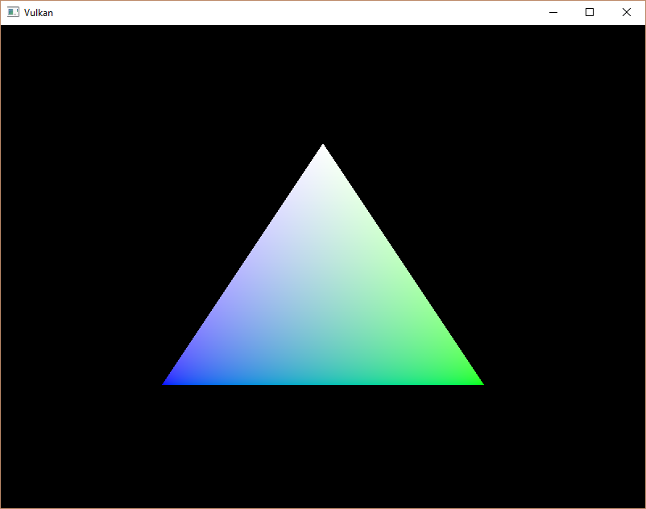

# Vulkan. Руководство разработчика. Создание вершинного буфера

## Вступление

Буферы в Vulkan — это участки памяти для хранения произвольных данных, которые могут читаться видеокартой. Буферы могут использоваться для разных целей, мы же будем использовать их для хранения данных вершин. В отличие от объектов Vulkan, которые встречались ранее, буферы не выделяют для себя память автоматически. Мы уже знаем, что Vulkan API позволяет разработчику контролировать практически каждый процесс, сюда относится и управление памятью.

## Создание буфера

Создадим новую функцию `createVertexBuffer` и вызовем ее из `initVulkan` прямо перед `createCommandBuffers`.

```cpp
void initVulkan() {
    createInstance();
    setupDebugMessenger();
    createSurface();
    pickPhysicalDevice();
    createLogicalDevice();
    createSwapChain();
    createImageViews();
    createRenderPass();
    createGraphicsPipeline();
    createFramebuffers();
    createCommandPool();
    createVertexBuffer();
    createCommandBuffers();
    createSyncObjects();
}

...

void createVertexBuffer() {

}
```

Для создания буфера требуется заполнить структуру [VkBufferCreateInfo](https://www.khronos.org/registry/vulkan/specs/1.2-extensions/man/html/VkBufferCreateInfo.html).

```cpp
VkBufferCreateInfo bufferInfo{};
bufferInfo.sType = VK_STRUCTURE_TYPE_BUFFER_CREATE_INFO;
bufferInfo.size = sizeof(vertices[0]) * vertices.size();
```

Первое поле структуры — `size`, оно определяет размер буфера в байтах. Размер данных в байтах легко можно вычислить с помощью `sizeof`.

```cpp
bufferInfo.usage = VK_BUFFER_USAGE_VERTEX_BUFFER_BIT;
```

Второе поле — `usage`, оно указывает, для каких целей будут использоваться данные в буфере. Для указания нескольких целей используется побитовый оператор `or`. Здесь мы укажем буфер вершин, другие случаи применения будут рассмотрены в следующих главах.

```cpp
bufferInfo.sharingMode = VK_SHARING_MODE_EXCLUSIVE;
```

Так же как и images в swap chain, буферы могут использоваться в единственном семействе очередей, либо доступ к ним может быть осуществлен сразу из нескольких очередей разных семейств. Наш буфер будет использоваться только графической очередью, поэтому мы указываем эксклюзивный доступ.

Параметр `flags` используется для работы с разреженным \(sparse\) размещением в памяти. Оно нас пока не интересует, поэтому оставим значение по умолчанию `0`.

Теперь мы можем создать буфер с помощью [vkCreateBuffer](https://www.khronos.org/registry/vulkan/specs/1.2-extensions/man/html/vkCreateBuffer.html). Определим член класса для хранения дескриптора буфера и назовем его `vertexBuffer`.

```cpp
VkBuffer vertexBuffer;

...

void createVertexBuffer() {
    VkBufferCreateInfo bufferInfo{};
    bufferInfo.sType = VK_STRUCTURE_TYPE_BUFFER_CREATE_INFO;
    bufferInfo.size = sizeof(vertices[0]) * vertices.size();
    bufferInfo.usage = VK_BUFFER_USAGE_VERTEX_BUFFER_BIT;
    bufferInfo.sharingMode = VK_SHARING_MODE_EXCLUSIVE;

    if (vkCreateBuffer(device, &bufferInfo, nullptr, &vertexBuffer) != VK_SUCCESS) {
        throw std::runtime_error("failed to create vertex buffer!");
    }
}
```

Буфер должен быть доступен для использования в командах рендеринга вплоть до окончания работы программы и не должен зависеть от swap chain, поэтому удалим его в `cleanup`:

```cpp
void cleanup() {
    cleanupSwapChain();

    vkDestroyBuffer(device, vertexBuffer, nullptr);

    ...
}
```

## Требования к выделяемой памяти

Итак, буфер создан, но память для него еще не выделена. Чтобы это сделать, сначала нужно запросить требования к памяти с помощью функции с соответствующим названием [vkGetBufferMemoryRequirements](https://www.khronos.org/registry/vulkan/specs/1.2-extensions/man/html/vkGetBufferMemoryRequirements.html).

```cpp
VkMemoryRequirements memRequirements;
vkGetBufferMemoryRequirements(device, vertexBuffer, &memRequirements);
```

Структура [VkMemoryRequirements](https://www.khronos.org/registry/vulkan/specs/1.2-extensions/man/html/VkMemoryRequirements.htmlZ) содержит три поля:

 - `size`: размер необходимого объема памяти в байтах, может отличаться от `bufferInfo.size`.
 - `alignment`: выравнивание буфера в байтах; смещение буфера относительно начала выделенного блока должно быть кратно этой величине. Зависит от `bufferInfo.usage` и `bufferInfo.flags`.
 - `memoryTypeBits`: битовое поле типов памяти, подходящих для буфера.


Видеокарты предлагают различные типы памяти для выделения. Они отличаются друг от друга разрешенными операциями и производительностью. Чтобы найти подходящий тип памяти, мы должны учитывать как требования буфера, так и требования нашей программы. Для этого создадим новую функцию `findMemoryType`.

```cpp
uint32_t findMemoryType(uint32_t typeFilter, VkMemoryPropertyFlags properties) {

}
```

Сначала запросим информацию о доступных типах памяти с помощью [vkGetPhysicalDeviceMemoryProperties](https://www.khronos.org/registry/vulkan/specs/1.2-extensions/man/html/vkGetPhysicalDeviceMemoryProperties.html).

```cpp
VkPhysicalDeviceMemoryProperties memProperties;
vkGetPhysicalDeviceMemoryProperties(physicalDevice, &memProperties);
```

Структура [VkPhysicalDeviceMemoryProperties](https://www.khronos.org/registry/vulkan/specs/1.2-extensions/man/html/VkPhysicalDeviceMemoryProperties.html) содержит два массива — `memoryTypes` и `memoryHeaps`. Массив `memoryHeaps` состоит из структур `VkMemoryHeap`. Каждая из них соответствует куче, из которой вы можете выделить память. Каждому типу памяти соответствует своя куча. Сейчас нас интересует только тип памяти, но вы можете иметь в виду, что выбор кучи может существенно влиять на производительность.

Прежде всего нам нужно найти тип памяти, подходящий для буфера:

```cpp
for (uint32_t i = 0; i < memProperties.memoryTypeCount; i++) {
    if (typeFilter & (1 << i)) {
        return i;
    }
}

throw std::runtime_error("failed to find suitable memory type!");
```

Параметр `typeFilter` используется для указания битового поля подходящих типов памяти. То есть мы можем найти индекс подходящего типа памяти, просто перебрав их и проверив, установлен ли соответствующий бит как `1`.

Однако нас интересует не только тип памяти. Нам важно, чтобы мы могли записывать в эту память данные вершин. Массив `memoryTypes` состоит из структур [VkMemoryType](https://www.khronos.org/registry/vulkan/specs/1.2-extensions/man/html/VkMemoryType.html), которые указывают кучу и свойства каждого типа памяти. Свойства определяют особенности памяти, например возможность отображения в память хоста, чтобы мы могли записывать в нее данные из CPU. Это свойство определяется как `VK_MEMORY_PROPERTY_HOST_VISIBLE_BIT`, но нам также понадобится свойство `VK_MEMORY_PROPERTY_HOST_COHERENT_BIT`. Позже станет ясно, зачем это нужно.

Теперь мы можем изменить цикл и проверить поддержку свойств:

```cpp
for (uint32_t i = 0; i < memProperties.memoryTypeCount; i++) {
    if ((typeFilter & (1 << i)) && (memProperties.memoryTypes[i].propertyFlags & properties) == properties) {
        return i;
    }
}
```

У нас может быть больше одного требуемого свойства, поэтому нужно проверить, чтобы результат побитового оператора AND был равен битовому полю необходимых свойств. Если есть такой тип памяти, который подходит для буфера и имеет все необходимые нам свойства, мы возвращаем его индекс, в противном случае генерируем исключение.

## Выделение памяти

Теперь, когда подходящий тип памяти найден, мы можем выделить ее, заполнив структуру VkMemoryAllocateInfo.

```cpp
VkMemoryAllocateInfo allocInfo{};
allocInfo.sType = VK_STRUCTURE_TYPE_MEMORY_ALLOCATE_INFO;
allocInfo.allocationSize = memRequirements.size;
allocInfo.memoryTypeIndex = findMemoryType(memRequirements.memoryTypeBits, VK_MEMORY_PROPERTY_HOST_VISIBLE_BIT | VK_MEMORY_PROPERTY_HOST_COHERENT_BIT);
```

Создадим член класса для хранения дескриптора памяти и выделим ее с помощью [vkAllocateMemory](https://www.khronos.org/registry/vulkan/specs/1.2-extensions/man/html/VkMemoryAllocateInfo.html).

```cpp
VkBuffer vertexBuffer;
VkDeviceMemory vertexBufferMemory;

...

if (vkAllocateMemory(device, &allocInfo, nullptr, &vertexBufferMemory) != VK_SUCCESS) {
    throw std::runtime_error("failed to allocate vertex buffer memory!");
}
```

Если выделение памяти прошло успешно, можно привязать к ней буфер с помощью [vkBindBufferMemory](https://www.khronos.org/registry/vulkan/specs/1.2-extensions/man/html/vkAllocateMemory.html):

```cpp
vkBindBufferMemory(device, vertexBuffer, vertexBufferMemory, 0);
```

Первые три параметра не требуют объяснений, четвертый параметр — это смещение в памяти. Поскольку память выделена специально для этого буфера, смещение равно `0`. Если смещение не равно нулю, оно должно быть кратно `memRequirements.alignment`.

Разумеется, как и динамическое выделение памяти в C++, в определенный момент память должна быть освобождена. Освободим ее после уничтожения буфера:

```cpp
void cleanup() {
    cleanupSwapChain();

    vkDestroyBuffer(device, vertexBuffer, nullptr);
    vkFreeMemory(device, vertexBufferMemory, nullptr);
```

## Заполнение вершинного буфера

Пришло время скопировать данные вершин в буфер. Это делается с помощью [отображения памяти буфера](https://en.wikipedia.org/wiki/Memory-mapped_I/O) в память хоста с помощью [vkMapMemory](https://www.khronos.org/registry/vulkan/specs/1.2-extensions/man/html/vkMapMemory.html).

```cpp
void* data;
vkMapMemory(device, vertexBufferMemory, 0, bufferInfo.size, 0, &data);
```

Эта функция позволяет получить доступ к участку памяти, определяемого смещением и размером, которые равны `0` и `bufferInfo.size` соответственно. Также можно указать специальное значение `VK_WHOLE_SIZE` для отображения всего выделенного участка. Предпоследний параметр можно использовать для указания флагов. Поскольку в текущем API доступных флагов пока нет, здесь нужно указать `0`. Последний параметр — это указатель, в который будет записан адрес начала отображаемой памяти.

```cpp
void* data;
vkMapMemory(device, vertexBufferMemory, 0, bufferInfo.size, 0, &data);
    memcpy(data, vertices.data(), (size_t) bufferInfo.size);
vkUnmapMemory(device, vertexBufferMemory);
```

Теперь вы можете скопировать данные вершин с помощью `memcpy` и отсоединиться от памяти буфера, используя [vkUnmapMemory](https://www.khronos.org/registry/vulkan/specs/1.2-extensions/man/html/vkUnmapMemory.html). Однако драйвер может не сразу начать копировать данные в буферную память, например, из-за кэширования. Также есть вероятность, что данные буфера не сразу будут видны в отображаемой памяти. Есть два способа решить эту проблему:

 - Использовать `VK_MEMORY_PROPERTY_HOST_COHERENT_BIT` для согласования памяти хоста с памятью видеокарты
 - Вызвать [vkFlushMappedMemoryRanges](https://www.khronos.org/registry/vulkan/specs/1.2-extensions/man/html/vkFlushMappedMemoryRanges.html) после записи данных в отображаемую память и [vkInvalidateMappedMemoryRanges](https://www.khronos.org/registry/vulkan/specs/1.2-extensions/man/html/vkInvalidateMappedMemoryRanges.html) перед чтением из отображенной памяти

Мы будем использовать первый способ, который гарантирует, что отображаемая память всегда соответствует содержимому выделенной памяти. Имейте в виду, что это может привести к снижению производительности, но позже мы объясним, почему нас это не останавливает.

Использование [vkFlushMappedMemoryRanges](https://www.khronos.org/registry/vulkan/specs/1.2-extensions/man/html/vkFlushMappedMemoryRanges.html) или когерентной памяти означает, что драйвер будет знать о том, что мы записали в память. Но это не означает, что эти данные будут немедленно видны на GPU. Передача данных в GPU — это операция, которая происходит в фоновом режиме, и в [спецификации](https://www.khronos.org/registry/vulkan/specs/1.0/html/vkspec.html#synchronization-submission-host-writes) сказано, что она будет завершена при следующем вызове [vkQueueSubmit](https://www.khronos.org/registry/vulkan/specs/1.2-extensions/man/html/vkQueueSubmit.html).

## Привязка вершинного буфера

Осталось привязать буфер вершин перед отрисовкой. Для этого расширим функцию `createCommandBuffers`.

```cpp
vkCmdBindPipeline(commandBuffers[i], VK_PIPELINE_BIND_POINT_GRAPHICS, graphicsPipeline);

VkBuffer vertexBuffers[] = {vertexBuffer};
VkDeviceSize offsets[] = {0};
vkCmdBindVertexBuffers(commandBuffers[i], 0, 1, vertexBuffers, offsets);

vkCmdDraw(commandBuffers[i], static_cast<uint32_t>(vertices.size()), 1, 0, 0);
```

Функция [vkCmdBindVertexBuffers](https://www.khronos.org/registry/vulkan/specs/1.2-extensions/man/html/vkCmdBindVertexBuffers.html) используется для привязки вершинных буферов. Первые два параметра, не считая буфера команд, определяют смещение и количество привязок. Последние два параметра определяют массив привязываемых буферов и смещения в байтах, откуда должны считываться данные вершин. Не забудьте изменить [vkCmdDraw](https://www.khronos.org/registry/vulkan/specs/1.2-extensions/man/html/vkCmdDraw.html), поменяв количество вершин с константы `3` на реальный размер буфера.

Теперь запустим программу, после чего на экране появится уже знакомый нам треугольник:


Попробуем изменить цвет верхней вершины на белый, внеся изменения в массив `vertices`:

```cpp
const std::vector<Vertex> vertices = {
    {{0.0f, -0.5f}, {1.0f, 1.0f, 1.0f}},
    {{0.5f, 0.5f}, {0.0f, 1.0f, 0.0f}},
    {{-0.5f, 0.5f}, {0.0f, 0.0f, 1.0f}}
};
```

Вот что должно получиться, если запустить программу еще раз:



В следующей главе мы рассмотрим другой способ копирования данных вершин в вершинный буфер, который обеспечит лучшую производительность, но потребует больше времени и усилий.

[C++ code](18_vertex_buffer.cpp) / [Vertex shader](17_shader_vertexbuffer.vert) / [Fragment shader](17_shader_vertexbuffer.frag)
