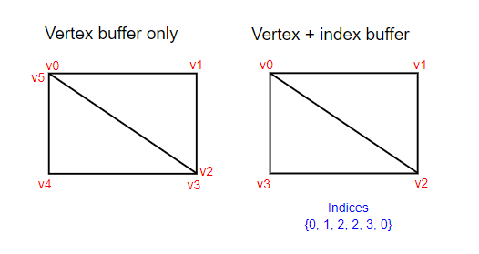

# Vulkan. Руководство разработчика. Индексный буфер

## Вступление

Во многих мешах, которые вы будете рендерить в реальных приложениях, одна вершина может быть общей для большого числа треугольников. Такое встречается даже в простом прямоугольнике:



Для отрисовки прямоугольника нужны два треугольника, поэтому нам понадобится вершинный буфер с 6 вершинами. Но проблема в том, что данные двух вершин необходимо дублировать, что приводит к 50% -ной избыточности. С более сложными объектами, где одна вершина повторно используется в среднем в 3 треугольниках, ситуация становится еще хуже. Для решения этой проблемы используется индексный буфер.

Индексный буфер — это, по сути, массив указателей на данные внутри вершинного буфера. Он позволяет перегруппировать данные вершин и повторно использовать существующие данные для нескольких вершин. На рисунке выше показано, как будет выглядеть индексный буфер для прямоугольника, если вершинный буфер не содержит повторений и состоит только из четырех вершин. Первые три индекса определяют правый верхний треугольник, а последние три индекса — нижний левый треугольник.

## Создание индексного буфера

В этой главе мы изменим данные вершин и добавим данные индексов, чтобы нарисовать прямоугольник, подобный тому, что изображен на картинке выше. Изменим данные вершин, чтобы представить четыре угла:

```cpp
const std::vector<Vertex> vertices = {
    {{-0.5f, -0.5f}, {1.0f, 0.0f, 0.0f}},
    {{0.5f, -0.5f}, {0.0f, 1.0f, 0.0f}},
    {{0.5f, 0.5f}, {0.0f, 0.0f, 1.0f}},
    {{-0.5f, 0.5f}, {1.0f, 1.0f, 1.0f}}
};
```

Левый верхний угол будет красным, правый верхний — зеленым, правый нижний — синим, а левый нижний — белым.

Добавим новый массив `indices`, чтобы представить содержимое индексного буфера. Индексы должны совпадать с индексами на картинке, чтобы мы могли нарисовать верхний правый треугольник и нижний левый треугольник.

```cpp
const std::vector<uint16_t> indices = {
    0, 1, 2, 2, 3, 0
};
```

Для индексного буфера можно использовать `uint16_t` или `uint32_t` в зависимости от количества элементов в `vertices`. Пока мы будем использовать `uint16_t`, поскольку у нас менее `65535` уникальных вершин.

Как и данные вершин, индексы должны быть загружены в [VkBuffer](https://www.khronos.org/registry/vulkan/specs/1.2-extensions/man/html/VkBuffer.html), чтобы GPU мог получить к ним доступ. Определим два новых члена класса для хранения ресурсов индексного буфера:

```cpp
VkBuffer vertexBuffer;
VkDeviceMemory vertexBufferMemory;
VkBuffer indexBuffer;
VkDeviceMemory indexBufferMemory;
```

Добавим функцию `createIndexBuffer`, которая практически идентична `createVertexBuffer`:

```cpp
void initVulkan() {
    ...
    createVertexBuffer();
    createIndexBuffer();
    ...
}

void createIndexBuffer() {
    VkDeviceSize bufferSize = sizeof(indices[0]) * indices.size();

    VkBuffer stagingBuffer;
    VkDeviceMemory stagingBufferMemory;
    createBuffer(bufferSize, VK_BUFFER_USAGE_TRANSFER_SRC_BIT, VK_MEMORY_PROPERTY_HOST_VISIBLE_BIT | VK_MEMORY_PROPERTY_HOST_COHERENT_BIT, stagingBuffer, stagingBufferMemory);

    void* data;
    vkMapMemory(device, stagingBufferMemory, 0, bufferSize, 0, &data);
    memcpy(data, indices.data(), (size_t) bufferSize);
    vkUnmapMemory(device, stagingBufferMemory);

    createBuffer(bufferSize, VK_BUFFER_USAGE_TRANSFER_DST_BIT | VK_BUFFER_USAGE_INDEX_BUFFER_BIT, VK_MEMORY_PROPERTY_DEVICE_LOCAL_BIT, indexBuffer, indexBufferMemory);

    copyBuffer(stagingBuffer, indexBuffer, bufferSize);

    vkDestroyBuffer(device, stagingBuffer, nullptr);
    vkFreeMemory(device, stagingBufferMemory, nullptr);
}
```

Есть лишь два заметных отличия. Теперь `bufferSize` равен количеству индексов, умноженному на размер типа индекса — `uint16_t` или `uint32_t`. И вместо `VK_BUFFER_USAGE_VERTEX_BUFFER_BIT` используется `VK_BUFFER_USAGE_INDEX_BUFFER_BIT`, что вполне логично. В остальном все то же самое. Мы создаем промежуточный буфер, чтобы скопировать в него содержимое `indices`, и уже из него скопировать данные в конечный локальный индексный буфер устройства.

Как и вершинный буфер, в конце работы программы индексный буфер нужно удалить:

```cpp
void cleanup() {
    cleanupSwapChain();

    vkDestroyBuffer(device, indexBuffer, nullptr);
    vkFreeMemory(device, indexBufferMemory, nullptr);

    vkDestroyBuffer(device, vertexBuffer, nullptr);
    vkFreeMemory(device, vertexBufferMemory, nullptr);

    ...
}
```

## Использование индексного буфера

Чтобы использовать индексный буфер, нужно внести пару изменений в `createCommandBuffers`. Сначала нужно привязать \(bind\) индексный буфер, как мы это делали с вершинным буфером. Разница в том, что индексный буфер может быть только один. К сожалению, нет способа использовать разные индексные буферы для каждого из атрибутов вершин. Поэтому, если 2 вершины отличаются, скажем, только по цвету, то нам всё равно придется дублировать их координаты.

```cpp
vkCmdBindVertexBuffers(commandBuffers[i], 0, 1, vertexBuffers, offsets);

vkCmdBindIndexBuffer(commandBuffers[i], indexBuffer, 0, VK_INDEX_TYPE_UINT16);
```

Для привязки индексного буфера используется функция [vkCmdBindIndexBuffer](https://www.khronos.org/registry/vulkan/specs/1.2-extensions/man/html/vkCmdBindIndexBuffer.html), которая содержит следующие параметры: привязываемый буфер, смещение начала внутри него в байтах и тип индексов. Как уже говорилось, в качестве типа данных используется `VK_INDEX_TYPE_UINT16` или `VK_INDEX_TYPE_UINT32`.

Одной привязки буфера недостаточно, мы также должны изменить команду рисования, чтобы сообщить Vulkan об использовании индексного буфера. Удалим строку [vkCmdDraw](https://www.khronos.org/registry/vulkan/specs/1.2-extensions/man/html/vkCmdDraw.html) и заменим ее на [vkCmdDrawIndexed](https://www.khronos.org/registry/vulkan/specs/1.2-extensions/man/html/vkCmdDrawIndexed.html):

```cpp
vkCmdDrawIndexed(commandBuffers[i], static_cast<uint32_t>(indices.size()), 1, 0, 0, 0);
```

Вызов этой функции очень похож на [vkCmdDraw](https://www.khronos.org/registry/vulkan/specs/1.2-extensions/man/html/vkCmdDraw.html). Первые два параметра определяют количество индексов и количество экземпляров \(instances\). Мы не используем инстансинг, поэтому укажем только `1` экземпляр. Количество индексов представляет собой количество вершин, которые будут переданы в вершинный буфер. Следующий параметр определяет смещение в индексном буфере. Если бы мы использовали значение `1`, видеокарта начала бы считывать данные со второго индекса. Предпоследний параметр указывает смещение, добавляемое к индексам в индексном буфере. Последний параметр указывает смещение для инстансинга, который мы не используем.

Если запустить программу, в результате должно получиться следующее:


Теперь вы знаете, как сэкономить память, повторно используя вершины с помощью индексного буфера. Это особенно пригодится, когда мы будем загружать сложные 3D-модели.

В предыдущих главах уже упоминалось о том, что вы должны выделять память сразу под несколько ресурсов, таких как буферы, но вы можете пойти еще дальше. [Разработчики драйверов рекомендуют](https://developer.nvidia.com/vulkan-memory-management) хранить несколько буферов, например вершинный и индексный буфер, в одном [VkBuffer](https://www.khronos.org/registry/vulkan/specs/1.2-extensions/man/html/VkBuffer.html) и использовать смещения в таких командах, как [vkCmdBindVertexBuffers](https://www.khronos.org/registry/vulkan/specs/1.2-extensions/man/html/vkCmdBindVertexBuffers.html). Преимущество этого в том, что тогда данные намного удобнее кешировать, поскольку они находятся ближе друг к другу. Более того, можно повторно использовать один и тот же кусок памяти для нескольких ресурсов, если они не используются во время одних и тех же операций рендеринга, при условии, конечно, что данные будут обновляться. Это называется алиасингом \(наложение\), и в некоторых функциях Vulkan есть явные флаги, указывающие на то, что вы хотите его использовать.

[Код C++](20_index_buffer.cpp) / [Вершинный шейдер](17_shader_vertexbuffer.vert) / [Фрагментный шейдер](17_shader_vertexbuffer.frag)
