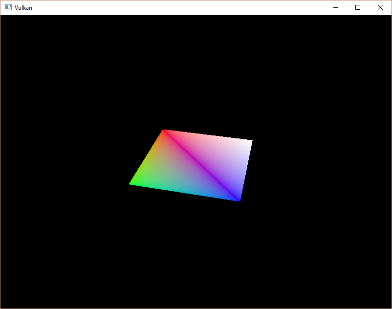

# Vulkan. Руководство разработчика. Пул дескрипторов и сеты дескрипторов

## Вступление

В предыдущей главе мы создали layout дескрипторов. Он определяет количество и типы дескрипторов, которые будут использованы для рендера. В этой главе мы свяжем наши [VkBuffer](https://www.khronos.org/registry/vulkan/specs/1.2-extensions/man/html/VkBuffer.html)-ы с соответствующими им дескрипторами. Для этого нам потребуется создать сет дескрипторов для каждого буфера.

## Пул дескрипторов

Сеты дескрипторов не могут быть созданы напрямую, их необходимо выделить из пула, как и буферы команд. Для создания пула дескрипторов напишем новую функцию `createDescriptorPool`.

```cpp
void initVulkan() {
    ...
    createUniformBuffers();
    createDescriptorPool();
    ...
}

...

void createDescriptorPool() {

}
```

Сначала нужно описать, какие типы дескрипторов содержатся в сетах дескрипторов, и их количество. Для этого используем структуру [VkDescriptorPoolSize](https://www.khronos.org/registry/vulkan/specs/1.2-extensions/man/html/VkDescriptorPoolSize.html).

```cpp
VkDescriptorPoolSize poolSize{};
poolSize.type = VK_DESCRIPTOR_TYPE_UNIFORM_BUFFER;
poolSize.descriptorCount = static_cast<uint32_t>(swapChainImages.size());
```

Мы будем выделять по одному дескриптору для каждого кадра. Указание на структуру `VkDescriptorPoolSize` содержится в [VkDescriptorPoolCreateInfo](https://www.khronos.org/registry/vulkan/specs/1.2-extensions/man/html/VkDescriptorPoolCreateInfo.html):

```cpp
VkDescriptorPoolCreateInfo poolInfo{};
poolInfo.sType = VK_STRUCTURE_TYPE_DESCRIPTOR_POOL_CREATE_INFO;
poolInfo.poolSizeCount = 1;
poolInfo.pPoolSizes = &poolSize;
```

Нам нужно указать не только максимальное количество отдельных доступных дескрипторов, но и максимальное количество сетов дескрипторов, которое можно выделить:

```cpp
poolInfo.maxSets = static_cast<uint32_t>(swapChainImages.size());
```

Структура содержит поле `flags`. Вы можете заполнить его значением `VK_DESCRIPTOR_POOL_CREATE_FREE_DESCRIPTOR_SET_BIT`, которое позволит освобождать сеты по отдельности. Мы не будем трогать сет дескрипторов после его создания, поэтому этот флаг нам не нужен. Вы можете оставить здесь значение по умолчанию `0`.

Добавим новый метод [vkCreateDescriptorPool](https://www.khronos.org/registry/vulkan/specs/1.2-extensions/man/html/vkCreateDescriptorPool.html) и поле `descriptorPool` для создания и хранения пула дескрипторов.

```cpp
VkDescriptorPool descriptorPool;

...

if (vkCreateDescriptorPool(device, &poolInfo, nullptr, &descriptorPool) != VK_SUCCESS) {
    throw std::runtime_error("failed to create descriptor pool!");
}
```

Пул дескрипторов должен быть уничтожен при пересоздании swap chain, поскольку он зависит от количества images:

```cpp
void cleanupSwapChain() {
    ...

    for (size_t i = 0; i < swapChainImages.size(); i++) {
        vkDestroyBuffer(device, uniformBuffers[i], nullptr);
        vkFreeMemory(device, uniformBuffersMemory[i], nullptr);
    }

    vkDestroyDescriptorPool(device, descriptorPool, nullptr);
}
```

А затем заново создан в `recreateSwapChain`:

```cpp
void recreateSwapChain() {
    ...

    createUniformBuffers();
    createDescriptorPool();
    createCommandBuffers();
}
```

## Сеты дескрипторов

Теперь мы можем выделить сеты дескрипторов. Для этого добавим функцию `createDescriptorSets`:

```cpp
void initVulkan() {
    ...
    createDescriptorPool();
    createDescriptorSets();
    ...
}

void recreateSwapChain() {
    ...
    createDescriptorPool();
    createDescriptorSets();
    ...
}

...

void createDescriptorSets() {

}
```

Выделение сетов дескрипторов описывается с помощью структуры [VkDescriptorSetAllocateInfo](https://www.khronos.org/registry/vulkan/specs/1.2-extensions/man/html/VkDescriptorSetAllocateInfo.html). Необходимо указать пул дескрипторов, из которого будут выделены сеты дескрипторов, количество выделяемых сетов и layout дескрипторов:

```cpp
std::vector<VkDescriptorSetLayout> layouts(swapChainImages.size(), descriptorSetLayout);
VkDescriptorSetAllocateInfo allocInfo{};
allocInfo.sType = VK_STRUCTURE_TYPE_DESCRIPTOR_SET_ALLOCATE_INFO;
allocInfo.descriptorPool = descriptorPool;
allocInfo.descriptorSetCount = static_cast<uint32_t>(swapChainImages.size());
allocInfo.pSetLayouts = layouts.data();
```

Мы создадим один сет дескрипторов для каждого image из swap chain, все с одним layout-ом. Нам потребуется сделать несколько копий хэндла layout-а, так как функция [vkAllocateDescriptorSets](https://www.khronos.org/registry/vulkan/specs/1.2-extensions/man/html/vkAllocateDescriptorSets.html) принимает массив layout-ов, по одному на каждый создаваемый сет.

Добавим поле `descriptorSets` для хранения сетов дескрипторов и выделим их с помощью [vkAllocateDescriptorSets](https://www.khronos.org/registry/vulkan/specs/1.2-extensions/man/html/vkAllocateDescriptorSets.html):

```cpp
VkDescriptorPool descriptorPool;
std::vector<VkDescriptorSet> descriptorSets;

...

descriptorSets.resize(swapChainImages.size());
if (vkAllocateDescriptorSets(device, &allocInfo, descriptorSets.data()) != VK_SUCCESS) {
    throw std::runtime_error("failed to allocate descriptor sets!");
}
```

Нет необходимости явно уничтожать сеты дескрипторов, поскольку они будут автоматически освобождены при уничтожении пула дескрипторов. Вызов [vkAllocateDescriptorSets](https://www.khronos.org/registry/vulkan/specs/1.2-extensions/man/html/vkAllocateDescriptorSets.html) выделит сеты дескрипторов, каждый из которых будет содержать дескриптор uniform-буфера.

Сеты дескрипторов выделены, однако дескрипторы внутри нуждаются в настройке. Добавим цикл, чтобы заполнить каждый дескриптор:

```cpp
for (size_t i = 0; i < swapChainImages.size(); i++) {

}
```

Дескрипторы, которые ссылаются на буферы, как наш дескриптор uniform-буфера, настраиваются с помощью структуры [VkDescriptorBufferInfo](https://www.khronos.org/registry/vulkan/specs/1.2-extensions/man/html/VkDescriptorBufferInfo.html). Эта структура указывает буфер и область внутри него, в которой содержатся данные для дескриптора.

```cpp
for (size_t i = 0; i < swapChainImages.size(); i++) {
    VkDescriptorBufferInfo bufferInfo{};
    bufferInfo.buffer = uniformBuffers[i];
    bufferInfo.offset = 0;
    bufferInfo.range = sizeof(UniformBufferObject);
}
```

Если вы полностью перезаписываете буфер, как мы в данном случае, то вы можете использовать значение `VK_WHOLE_SIZE` для поля range. Настройки дескрипторов обновляются с помощью функции [vkUpdateDescriptorSets](https://www.khronos.org/registry/vulkan/specs/1.2-extensions/man/html/vkUpdateDescriptorSets.html), которая принимает в качестве параметра массив структур [VkWriteDescriptorSet](https://www.khronos.org/registry/vulkan/specs/1.2-extensions/man/html/VkWriteDescriptorSet.html).

```cpp
VkWriteDescriptorSet descriptorWrite{};
descriptorWrite.sType = VK_STRUCTURE_TYPE_WRITE_DESCRIPTOR_SET;
descriptorWrite.dstSet = descriptorSets[i];
descriptorWrite.dstBinding = 0;
descriptorWrite.dstArrayElement = 0;
```

Первые два поля указывают сет дескрипторов, который нужно обновить, и привязку \(binding\). Мы присвоили нашей привязке индекс `0`. Обратите внимание, что одной привязке может соответствовать массив ресурсов, а значит и дескрипторы внутри сета будут сгруппированы в массив. Поэтому мы должны указать индекс первого элемента, с которого надо начать обновление. Мы не используем массив, поэтому индекс равен `0`.

```cpp
descriptorWrite.descriptorType = VK_DESCRIPTOR_TYPE_UNIFORM_BUFFER;
descriptorWrite.descriptorCount = 1;
```

Теперь снова укажем тип дескриптора. Можно обновить сразу несколько дескрипторов в массиве, начиная с индекса `dstArrayElement`. Поле `descriptorCount` указывает, сколько элементов массива нужно обновить.

```cpp
descriptorWrite.pBufferInfo = &bufferInfo;
descriptorWrite.pImageInfo = nullptr; // Optional
descriptorWrite.pTexelBufferView = nullptr; // Optional
```

Последнее поле ссылается на массив структур, которые настраивают дескрипторы. Массив должен иметь длину `descriptorCount`. Поле `pBufferInfo` используется для дескрипторов, которые ссылаются на данные буфера, `pImageInfo` используется для дескрипторов, которые ссылаются на данные image, а `pTexelBufferView` используется для дескрипторов, которые ссылаются на buffer views. Наш дескриптор ссылается на буферы, поэтому мы используем `pBufferInfo`.

```cpp
vkUpdateDescriptorSets(device, 1, &descriptorWrite, 0, nullptr);
```

Обновления применяются с помощью [vkUpdateDescriptorSets](https://www.khronos.org/registry/vulkan/specs/1.2-extensions/man/html/vkUpdateDescriptorSets.html). Функция принимает два массива: массив структур [VkWriteDescriptorSet](https://www.khronos.org/registry/vulkan/specs/1.2-extensions/man/html/VkWriteDescriptorSet.html) и массив [VkCopyDescriptorSet](https://www.khronos.org/registry/vulkan/specs/1.2-extensions/man/html/VkCopyDescriptorSet.html). Последний может использоваться для копирования дескрипторов, что следует из его названия.

## Использование сетов дескрипторов

Теперь нужно обновить функцию `createCommandBuffers`, чтобы с помощью [vkCmdBindDescriptorSets](https://www.khronos.org/registry/vulkan/specs/1.2-extensions/man/html/vkCmdBindDescriptorSets.html) привязать подходящий сет дескрипторов к дескрипторам в шейдере. Это необходимо выполнить перед вызовом [vkCmdDrawIndexed](https://www.khronos.org/registry/vulkan/specs/1.2-extensions/man/html/vkCmdDrawIndexed.html):

```cpp
vkCmdBindDescriptorSets(commandBuffers[i], VK_PIPELINE_BIND_POINT_GRAPHICS, pipelineLayout, 0, 1, &descriptorSets[i], 0, nullptr);
vkCmdDrawIndexed(commandBuffers[i], static_cast<uint32_t>(indices.size()), 1, 0, 0, 0);
```

В отличие от вершинных и индексных буферов, сеты дескрипторов могут использоваться не только с графическими конвейерами. Именно поэтому нужно указать, к какому конвейеру мы хотим привязать сеты — к графическому или вычислительному. Следующий параметр — это layout дескрипторов. Следующие три параметра указывают индекс первого сета дескрипторов, количество сетов и массив сетов, которые нужно привязать. Скоро мы к ним вернемся. Последние два параметра указывают массив смещений, используемых для динамических дескрипторов. Их мы рассмотрим в следующих главах.

Если запустить программу сейчас, то окажется, что ничего не отображается. Проблема в том, что из-за инвертирования Y, которое мы сделали в матрице проекции, вершины теперь следуют в порядке «против часовой стрелки» вместо "по часовой". Из-за этого треугольники отбраковываются на стадии кулинга \(backface culling\) и геометрия не отрисовывается. Чтобы это исправить, в функции `createGraphicsPipeline` изменим `frontFace` в [VkPipelineRasterizationStateCreateInfo](https://www.khronos.org/registry/vulkan/specs/1.2-extensions/man/html/VkPipelineRasterizationStateCreateInfo.html):

```cpp
rasterizer.cullMode = VK_CULL_MODE_BACK_BIT;
rasterizer.frontFace = VK_FRONT_FACE_COUNTER_CLOCKWISE;
```

Снова запустим программу, в результате чего должно появиться следующее:



Прямоугольник превратился в квадрат, т.к. матрица проекции скорректировала отношение сторон. Функция `updateUniformBuffer` следит за изменением размеров экрана, поэтому нам не нужно пересоздавать сет дескрипторов в `recreateSwapChain`.

## Требования к выравниванию

До сих пор мы не рассматривали, как именно данные в структуре C ++ должны соответствовать определению uniform-ы в шейдере. Кажется достаточно очевидным просто использовать одни и те же типы в обоих:

```cpp
struct UniformBufferObject {
    glm::mat4 model;
    glm::mat4 view;
    glm::mat4 proj;
};

layout(binding = 0) uniform UniformBufferObject {
    mat4 model;
    mat4 view;
    mat4 proj;
} ubo;
```

Однако это еще не все. Попробуем изменить структуру и шейдер следующим образом:

```cpp
struct UniformBufferObject {
    glm::vec2 foo;
    glm::mat4 model;
    glm::mat4 view;
    glm::mat4 proj;
};

layout(binding = 0) uniform UniformBufferObject {
    vec2 foo;
    mat4 model;
    mat4 view;
    mat4 proj;
} ubo;
```

Перекомпилируем шейдер и программу. Теперь, если ее запустить, обнаружится, что цветовой квадрат, с которым мы работали все это время, исчез! А все потому, что мы не учли требования к выравниванию.

Vulkan ожидает, что данные в структуре будут выровнены в памяти определенным образом, например:

 - Скаляры должны быть выровнены по N \(= 4 байта или 32-битное число с плавающей запятой\)
 - `vec2` должен быть выровнен по 2N \(= 8 байтов\)
 - `vec3` или `vec4` должны быть выровнены по 4N \(= 16 байтов\)
 - Матрица `mat4` должна иметь такое же выравнивание, как и `vec4`.

Вы можете найти полный список требований к выравниванию в [спецификации](https://www.khronos.org/registry/vulkan/specs/1.1-extensions/html/chap14.html#interfaces-resources-layout).

Наш исходный шейдер, в котором было всего три поля `mat4`, отвечал требованиям выравнивания. Размер каждого `mat4` равен 64 байта \(4 x 4 x 4 = 64\), а значит смещение model-матрицы = `0`, смещение view-матрицы = `64`, а proj-матрицы = `128`. Все они кратны 16, поэтому все работало нормально.

Новая структура начинается с `vec2`, размер которого всего 8 байт, поэтому все смещения портятся. Теперь смещение model-матрицы = `8`, смещение view-матрицы = `72`, а proj-матрицы = `136`, но ни одно из них не кратно 16. Чтобы решить эту проблему, мы можем использовать спецификатор [alignas](https://en.cppreference.com/w/cpp/language/alignas), добавленный в C ++ 11:

```cpp
struct UniformBufferObject {
    glm::vec2 foo;
    alignas(16) glm::mat4 model;
    glm::mat4 view;
    glm::mat4 proj;
};
```

Если мы заново скомпилируем и запустим программу, то увидим, что теперь шейдер корректно получает значения матрицы, как раньше.

К счастью, есть способ не думать об этих требованиях к выравниванию постоянно. Мы можем добавить дефайн `GLM_FORCE_DEFAULT_ALIGNED_GENTYPES` прямо перед GLM:

```cpp
#define GLM_FORCE_RADIANS
#define GLM_FORCE_DEFAULT_ALIGNED_GENTYPES
#include <glm/glm.hpp>
```

Это заставит GLM использовать версию `vec2` и `mat4`, в которой уже заданы требования к выравниванию. Если вы добавите это определение, то сможете удалить спецификатор `alignas`, и программа все равно будет работать.

Однако этот метод может не сработать при использовании вложенных структур. Рассмотрим следующее определение в коде C ++:

```cpp
struct Foo {
    glm::vec2 v;
};

struct UniformBufferObject {
    Foo f1;
    Foo f2;
};
```

И определение в шейдере:

```glsl
struct Foo {
    vec2 v;
};

layout(binding = 0) uniform UniformBufferObject {
    Foo f1;
    Foo f2;
} ubo;
```

В этом случае `f2` будет иметь смещение `8`, тогда как оно должно быть `16`, поскольку это вложенная структура. В таком случае вам нужно самим указать выравнивание:

```cpp
struct UniformBufferObject {
    Foo f1;
    alignas(16) Foo f2;
};
```

Как видите, выравнивание лучше прописывать явно. Таким образом, вы не будете застигнуты врасплох неожиданными ошибками.

```cpp
struct UniformBufferObject {
    alignas(16) glm::mat4 model;
    alignas(16) glm::mat4 view;
    alignas(16) glm::mat4 proj;
};
```

Не забудьте перекомпилировать шейдер после удаления поля `foo`.

## Множества сетов дескрипторов

Вы можете привязать несколько сетов дескрипторов одновременно. Для этого при создании layout-а конвейера необходимо указать несколько layout-ов дескрипторов (по одному на каждый сет). После этого шейдеры могут ссылаться на определенные сеты дескрипторов следующим образом:

```cpp
layout(set = 0, binding = 0) uniform UniformBufferObject { ... }
```

Вы можете использовать это, чтобы разделить сеты на общие для всех объектов и специфичные для каждого объекта. В таком случае вам удастся избежать повторной привязки большинства дескрипторов между вызовами отрисовки, что потенциально более эффективно.

[Код С++](22_descriptor_sets.cpp) / [Вершинный шейдер](21_shader_ubo.vert) / [Фрагментный шейдер](21_shader_ubo.frag)
