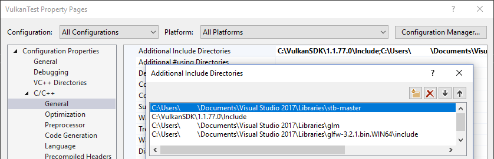

# Vulkan. Руководство разработчика. Текстурирование

## Вступление

До сих пор геометрия окрашивалась за счет цветов ее вершин, однако такой подход довольно ограничен. В этом уроке мы реализуем текстурирование, чтобы сделать нашу геометрию интереснее. Благодаря этому мы сможем загружать и рисовать базовые 3D-модели в будущем.

Чтобы добавить текстуру в приложение, нужно выполнить следующие шаги:

 - Создать объект image, поддерживаемый памятью устройства
 - Заполнить его пикселями из файла изображения
 - Создать image sampler
 - Добавить комбинированный image-sampler дескриптор

До этого мы уже работали с объектами image, но они автоматически создавались расширением swap chain. На этот раз мы должны сделать это сами. Создание и заполнение image данными похоже на создание вершинного буфера. Сначала мы создадим промежуточный ресурс и заполним его данными пикселей. Затем скопируем его в конечный объект image, который будем использовать для рендеринга. Для этой цели мы могли бы создать промежуточный image, но в Vulkan мы можем копировать пиксели из [VkBuffer](https://www.khronos.org/registry/vulkan/specs/1.2-extensions/man/html/VkBuffer.html) в image, и на [некотором оборудовании это будет работать быстрее](https://developer.nvidia.com/vulkan-memory-management). Итак, сначала создадим буфер и заполним его данными пикселей, а затем создадим image, в который скопируем пиксели. Создание image не сильно отличается от создания буфера. Нам нужно запросить требования к памяти, выделить память и привязать ее к image.

Однако есть кое-что еще, о чем мы должны помнить при работе с image. Images могут иметь разный layout, что влияет на размещение пикселей в памяти. Например, из-за особенностей работы графического оборудования построчное хранение пикселей может быть не самым лучшим способом для обеспечения высокой производительности. Выполняя операции с images, мы должны убедиться, что их layout оптимален для этих операций.

Некоторые из этих layout-ов мы уже видели, когда создавали `VkRenderPass`:

 - `VK_IMAGE_LAYOUT_PRESENT_SRC_KHR`: оптимален для отображения на экране
 - `VK_IMAGE_LAYOUT_COLOR_ATTACHMENT_OPTIMAL`: оптимален в качестве цветового буфера из фреймбуфера
 - `VK_IMAGE_LAYOUT_TRANSFER_SRC_OPTIMAL`: оптимален в качестве источника во время операции копирования данных, например [vkCmdCopyImageToBuffer](https://www.khronos.org/registry/vulkan/specs/1.2-extensions/man/html/vkCmdCopyImageToBuffer.html)
 - `VK_IMAGE_LAYOUT_TRANSFER_DST_OPTIMAL`: оптимален в качестве назначения во время операции копирования данных, например [vkCmdCopyBufferToImage](https://www.khronos.org/registry/vulkan/specs/1.2-extensions/man/html/vkCmdCopyBufferToImage.html)
 - `VK_IMAGE_LAYOUT_SHADER_READ_ONLY_OPTIMAL`: оптимален для чтения из шейдера


Один из самых распространенных способов преобразования layout-а у image — это конвейерный барьер. Конвейерные барьеры в основном используются для синхронизации доступа к ресурсам, например, чтобы сначала завершить запись image и только потом начать чтение из него. Однако их также можно использовать для преобразования layout-ов, о чем мы и поговорим в этой главе. Кроме того, барьеры могут использоваться для передачи владения ресурсом от одного семейства очередей к другому, если, конечно, вы используете флаг `VK_SHARING_MODE_EXCLUSIVE`.

## Библиотека для работы с изображениями

Для загрузки изображений доступно множество библиотек. Вы даже можете написать собственный код для загрузки таких простых форматов, как BMP и PPM. В этом уроке мы будем использовать библиотеку stb_image из [коллекции stb](https://github.com/nothings/stb). Ее преимущество в том, что весь код находится в одном файле, и настроить проект будет очень просто. Загрузим `stb_image.h` и сохраним его в удобном месте, например, в ту же папку, в которой хранятся GLFW и GLM. Добавим расположение файла в include path.

### Visual Studio
Добавим папку с `stb_image.h` в `Additional Include Directories`.



### Makefile

Добавим папку с `stb_image.h` в include для GCC:

```
VULKAN_SDK_PATH = /home/user/VulkanSDK/x.x.x.x/x86_64
STB_INCLUDE_PATH = /home/user/libraries/stb

...

CFLAGS = -std=c++17 -I$(VULKAN_SDK_PATH)/include -I$(STB_INCLUDE_PATH)
```

## Загрузка изображения

Подключим библиотеку следующим образом:

```cpp
#define STB_IMAGE_IMPLEMENTATION
#include <stb_image.h>
```

По умолчанию заголовочный файл определяет только прототипы функций. Один файл кода должен включать в себя заголовочный файл с определением `STB_IMAGE_IMPLEMENTATION`, чтобы подключить тело функций, иначе мы получим ошибку линковки.

```cpp
void initVulkan() {
    ...
    createCommandPool();
    createTextureImage();
    createVertexBuffer();
    ...
}

...

void createTextureImage() {

}
```

Создадим новую функцию `createTextureImage`, чтобы загрузить изображение в `VkImage`. Мы будем использовать буферы команд, поэтому функцию нужно вызвать после `createCommandPool`.

Рядом с папкой `shaders` создадим папку `textures`, в которой будут храниться текстуры. Загрузим в нее изображение с именем `texture.jpg`. Я использую изображение размером 512 x 512 пикселей, которое находится под [лицензией CC0](https://pixabay.com/photos/statue-sculpture-figure-1275469/), но вы можете выбрать любое другое. Библиотека поддерживает наиболее распространенные форматы изображений — JPEG, PNG, BMP и GIF.


Загрузить изображение с помощью этой библиотеки очень просто:

```cpp
void createTextureImage() {
    int texWidth, texHeight, texChannels;
    stbi_uc* pixels = stbi_load("textures/texture.jpg", &texWidth, &texHeight, &texChannels, STBI_rgb_alpha);
    VkDeviceSize imageSize = texWidth * texHeight * 4;

    if (!pixels) {
        throw std::runtime_error("failed to load texture image!");
    }
}
```

Функция `stbi_load` принимает в качестве аргументов путь к файлу и количество каналов изображения. Значение `STBI_rgb_alpha` заставляет загружать изображение с альфа-каналом, даже если его нет. В будущем это обеспечит совместимость с другими текстурами. Средние три параметра — это выходные данные для ширины, высоты и количества каналов изображения. Возвращаемый указатель — это указатель на данные первого пикселя. Пиксели располагаются построчно. Если мы используем `STBI_rgb_alpha`, то каждый из пикселей занимает 4 байта, а все данные изображения `texWidth * texHeight * 4` байт.

## Промежуточный буфер

Теперь создадим буфер в памяти, видимой для хоста, чтобы мы могли использовать `vkMapMemory` и копировать туда пиксели. Добавим переменные для временного буфера в функцию `createTextureImage`:

```cpp
VkBuffer stagingBuffer;
VkDeviceMemory stagingBufferMemory;
```

Буфер должен использоваться в качестве источника передачи, чтобы мы смогли скопировать данные из него в `VkImage`:

```cpp
createBuffer(imageSize, VK_BUFFER_USAGE_TRANSFER_SRC_BIT, VK_MEMORY_PROPERTY_HOST_VISIBLE_BIT | VK_MEMORY_PROPERTY_HOST_COHERENT_BIT, stagingBuffer, stagingBufferMemory);
```

Теперь мы можем напрямую скопировать данные пикселей в буфер:

```cpp
void* data;
vkMapMemory(device, stagingBufferMemory, 0, imageSize, 0, &data);
    memcpy(data, pixels, static_cast<size_t>(imageSize));
vkUnmapMemory(device, stagingBufferMemory);
```

И удалить исходный массив пикселей:

```cpp
stbi_image_free(pixels);
```

## Текстура

Мы могли бы настроить шейдер для доступа к данным пикселей в буфере, но лучше всего использовать для этого объекты `VkImage`. Они, как минимум, упростят и ускорят получение цвета благодаря использованию 2D-координат. Пиксели, из которых состоит `VkImage`, называются текселами, в дальнейшем мы будем использовать именно это название.

Добавим следующие члены класса:

```cpp
VkImage textureImage;
VkDeviceMemory textureImageMemory;
```

Параметры для image указываются в структуре [VkImageCreateInfo](https://www.khronos.org/registry/vulkan/specs/1.2-extensions/man/html/VkImageCreateInfo.html):

```cpp
VkImageCreateInfo imageInfo{};
imageInfo.sType = VK_STRUCTURE_TYPE_IMAGE_CREATE_INFO;
imageInfo.imageType = VK_IMAGE_TYPE_2D;
imageInfo.extent.width = static_cast<uint32_t>(texWidth);
imageInfo.extent.height = static_cast<uint32_t>(texHeight);
imageInfo.extent.depth = 1;
imageInfo.mipLevels = 1;
imageInfo.arrayLayers = 1;
```

`imageType` сообщает Vulkan, в какой системе координат будут обрабатываться текселы в image. Можно создать 1D, 2D и 3D изображения. Одномерные изображения могут использоваться для хранения массива данных или градиента, двумерные изображения используются в основном для текстур, а трехмерные изображения могут использоваться, например, для хранения вокселей. В поле `extent` указываются размеры изображения — количество текселов на каждой оси. Поэтому `depth` равен `1`, а не `0`. Наша текстура — это не массив, и использовать мипмаппинг мы пока не будем.

```cpp
imageInfo.format = VK_FORMAT_R8G8B8A8_SRGB;
```

Vulkan поддерживает множество возможных форматов изображений, но для текселов мы должны использовать тот же формат, что и для пикселей в буфере.

```cpp
imageInfo.tiling = VK_IMAGE_TILING_OPTIMAL;
```

В поле `tiling` может быть одно из двух значений:

 - `VK_IMAGE_TILING_LINEAR`: текселы располагаются построчно, как и наш массив `pixels`
 - `VK_IMAGE_TILING_OPTIMAL`: текселы располагаются в порядке, определенном реализацией, для обеспечения оптимального доступа


В отличие от layout-а `tiling` нельзя будет изменить. Если вы хотите иметь прямой доступ к текселам в памяти изображения, используйте `VK_IMAGE_TILING_LINEAR`. Нам это не понадобится, поскольку мы используем промежуточный буфер. Мы будем использовать `VK_IMAGE_TILING_OPTIMAL` для эффективного доступа из шейдера.

```cpp
imageInfo.initialLayout = VK_IMAGE_LAYOUT_UNDEFINED;
```

Для `initialLayout` возможны два значения:

 - `VK_IMAGE_LAYOUT_UNDEFINED`: layout не используется ни для каких операций на GPU, данные в image не имеют значения и могут быть потеряны при изменении layout-a.
 - `VK_IMAGE_LAYOUT_PREINITIALIZED`: также не используется ни для каких операций на GPU, но при изменении layout-а данные сохраняются.


Ситуаций, когда необходимо сохранить текселы во время первого преобразования, немного. Это может понадобиться, например, если вы хотите использовать image вместо промежуточного буфера для загрузки текстуры на GPU. Для этого вы можете создать image с тайлингом `VK_IMAGE_TILING_LINEAR`, записать туда данные, а дальше использовать как источник при копировании данных. Однако мы используем для загрузки буфер, поэтому данные, которые были в памяти изображения, нас не интересуют, и мы смело можем использовать `VK_IMAGE_LAYOUT_UNDEFINED`.

```cpp
imageInfo.usage = VK_IMAGE_USAGE_TRANSFER_DST_BIT | VK_IMAGE_USAGE_SAMPLED_BIT;
```

Поле `usage` имеет тот же смысл, что и при создании буфера. Image будет использоваться в качестве назначения при копировании из буфера, поэтому здесь мы указываем `VK_IMAGE_USAGE_TRANSFER_DST_BIT`. Кроме того, нам нужен доступ к image из шейдера, поэтому мы также укажем `VK_IMAGE_USAGE_SAMPLED_BIT`.

```cpp
imageInfo.sharingMode = VK_SHARING_MODE_EXCLUSIVE;
```

Наш image будет использоваться только одной очередью команд.

```cpp
imageInfo.samples = VK_SAMPLE_COUNT_1_BIT;
imageInfo.flags = 0; // Optional
```

Флаг `samples` связан с мультисэмплингом. Он актуален только для images, которые используются в качестве буферов, поэтому мы используем значение `1`. Есть несколько дополнительных флагов для images, которые связаны со sparse images. Sparse images — это images, где память выделяется только для некоторых определенных участков. Например, если вы используете 3D-текстуру для воксельного ландшафта, вы можете использовать sparse images, чтобы избежать выделения памяти для хранения больших объемов со значением "воздух". В руководстве нам это не понадобится, поэтому оставим значение по умолчанию `0`.

```cpp
if (vkCreateImage(device, &imageInfo, nullptr, &textureImage) != VK_SUCCESS) {
    throw std::runtime_error("failed to create image!");
}
```

Image создается с помощью [vkCreateImage](https://www.khronos.org/registry/vulkan/specs/1.2-extensions/man/html/vkCreateImage.html), в которой нет примечательных для нас параметров. Может случиться так, что `VK_FORMAT_R8G8B8A8_SRGB` не будет поддерживаться вашим графическим оборудованием. На этот случай у вас должен быть список альтернатив, где вы сможете выбрать наиболее подходящий поддерживаемый формат. Однако `VK_FORMAT_R8G8B8A8_SRGB` поддерживается практически везде, поэтому мы пропустим этот шаг.

```cpp
VkMemoryRequirements memRequirements;
vkGetImageMemoryRequirements(device, textureImage, &memRequirements);

VkMemoryAllocateInfo allocInfo{};
allocInfo.sType = VK_STRUCTURE_TYPE_MEMORY_ALLOCATE_INFO;
allocInfo.allocationSize = memRequirements.size;
allocInfo.memoryTypeIndex = findMemoryType(memRequirements.memoryTypeBits, VK_MEMORY_PROPERTY_DEVICE_LOCAL_BIT);

if (vkAllocateMemory(device, &allocInfo, nullptr, &textureImageMemory) != VK_SUCCESS) {
    throw std::runtime_error("failed to allocate image memory!");
}

vkBindImageMemory(device, textureImage, textureImageMemory, 0);
```

Выделение памяти для image происходит так же, как выделение памяти для буфера. Только вместо [vkGetBufferMemoryRequirements](https://www.khronos.org/registry/vulkan/specs/1.2-extensions/man/html/vkGetBufferMemoryRequirements.html) мы используем [vkGetImageMemoryRequirements](https://www.khronos.org/registry/vulkan/specs/1.2-extensions/man/html/vkGetImageMemoryRequirements.html), а вместо [vkBindBufferMemory](https://www.khronos.org/registry/vulkan/specs/1.2-extensions/man/html/vkBindBufferMemory.html) — [vkBindImageMemory](https://www.khronos.org/registry/vulkan/specs/1.2-extensions/man/html/vkBindImageMemory.html).

Эта функция и так довольно большая, а в следующих главах нам потребуется создать еще больше images, поэтому поместим создание image в отдельную функцию `createImage`, как мы это делали с буферами. Создадим функцию и перенесем в нее создание `VkImage` и выделение памяти:

```cpp
void createImage(uint32_t width, uint32_t height, VkFormat format, VkImageTiling tiling, VkImageUsageFlags usage, VkMemoryPropertyFlags properties, VkImage& image, VkDeviceMemory& imageMemory) {
    VkImageCreateInfo imageInfo{};
    imageInfo.sType = VK_STRUCTURE_TYPE_IMAGE_CREATE_INFO;
    imageInfo.imageType = VK_IMAGE_TYPE_2D;
    imageInfo.extent.width = width;
    imageInfo.extent.height = height;
    imageInfo.extent.depth = 1;
    imageInfo.mipLevels = 1;
    imageInfo.arrayLayers = 1;
    imageInfo.format = format;
    imageInfo.tiling = tiling;
    imageInfo.initialLayout = VK_IMAGE_LAYOUT_UNDEFINED;
    imageInfo.usage = usage;
    imageInfo.samples = VK_SAMPLE_COUNT_1_BIT;
    imageInfo.sharingMode = VK_SHARING_MODE_EXCLUSIVE;

    if (vkCreateImage(device, &imageInfo, nullptr, &image) != VK_SUCCESS) {
        throw std::runtime_error("failed to create image!");
    }

    VkMemoryRequirements memRequirements;
    vkGetImageMemoryRequirements(device, image, &memRequirements);

    VkMemoryAllocateInfo allocInfo{};
    allocInfo.sType = VK_STRUCTURE_TYPE_MEMORY_ALLOCATE_INFO;
    allocInfo.allocationSize = memRequirements.size;
    allocInfo.memoryTypeIndex = findMemoryType(memRequirements.memoryTypeBits, properties);

    if (vkAllocateMemory(device, &allocInfo, nullptr, &imageMemory) != VK_SUCCESS) {
        throw std::runtime_error("failed to allocate image memory!");
    }

    vkBindImageMemory(device, image, imageMemory, 0);
}
```

Теперь можно упростить функцию `createTextureImage`:

```cpp
void createTextureImage() {
    int texWidth, texHeight, texChannels;
    stbi_uc* pixels = stbi_load("textures/texture.jpg", &texWidth, &texHeight, &texChannels, STBI_rgb_alpha);
    VkDeviceSize imageSize = texWidth * texHeight * 4;

    if (!pixels) {
        throw std::runtime_error("failed to load texture image!");
    }

    VkBuffer stagingBuffer;
    VkDeviceMemory stagingBufferMemory;
    createBuffer(imageSize, VK_BUFFER_USAGE_TRANSFER_SRC_BIT, VK_MEMORY_PROPERTY_HOST_VISIBLE_BIT | VK_MEMORY_PROPERTY_HOST_COHERENT_BIT, stagingBuffer, stagingBufferMemory);

    void* data;
    vkMapMemory(device, stagingBufferMemory, 0, imageSize, 0, &data);
        memcpy(data, pixels, static_cast<size_t>(imageSize));
    vkUnmapMemory(device, stagingBufferMemory);

    stbi_image_free(pixels);

    createImage(texWidth, texHeight, VK_FORMAT_R8G8B8A8_SRGB, VK_IMAGE_TILING_OPTIMAL, VK_IMAGE_USAGE_TRANSFER_DST_BIT | VK_IMAGE_USAGE_SAMPLED_BIT, VK_MEMORY_PROPERTY_DEVICE_LOCAL_BIT, textureImage, textureImageMemory);
}
```

## Преобразования layout-a

Функция, которую мы пишем, опять будет включать в себя заполнение и запуск буфера команд, поэтому самое время переместить эту логику в одну или две вспомогательные функции:

```cpp
VkCommandBuffer beginSingleTimeCommands() {
    VkCommandBufferAllocateInfo allocInfo{};
    allocInfo.sType = VK_STRUCTURE_TYPE_COMMAND_BUFFER_ALLOCATE_INFO;
    allocInfo.level = VK_COMMAND_BUFFER_LEVEL_PRIMARY;
    allocInfo.commandPool = commandPool;
    allocInfo.commandBufferCount = 1;

    VkCommandBuffer commandBuffer;
    vkAllocateCommandBuffers(device, &allocInfo, &commandBuffer);

    VkCommandBufferBeginInfo beginInfo{};
    beginInfo.sType = VK_STRUCTURE_TYPE_COMMAND_BUFFER_BEGIN_INFO;
    beginInfo.flags = VK_COMMAND_BUFFER_USAGE_ONE_TIME_SUBMIT_BIT;

    vkBeginCommandBuffer(commandBuffer, &beginInfo);

    return commandBuffer;
}

void endSingleTimeCommands(VkCommandBuffer commandBuffer) {
    vkEndCommandBuffer(commandBuffer);

    VkSubmitInfo submitInfo{};
    submitInfo.sType = VK_STRUCTURE_TYPE_SUBMIT_INFO;
    submitInfo.commandBufferCount = 1;
    submitInfo.pCommandBuffers = &commandBuffer;

    vkQueueSubmit(graphicsQueue, 1, &submitInfo, VK_NULL_HANDLE);
    vkQueueWaitIdle(graphicsQueue);

    vkFreeCommandBuffers(device, commandPool, 1, &commandBuffer);
}
```

Эту функцию можно упростить:

```cpp
void copyBuffer(VkBuffer srcBuffer, VkBuffer dstBuffer, VkDeviceSize size) {
    VkCommandBuffer commandBuffer = beginSingleTimeCommands();

    VkBufferCopy copyRegion{};
    copyRegion.size = size;
    vkCmdCopyBuffer(commandBuffer, srcBuffer, dstBuffer, 1, &copyRegion);

    endSingleTimeCommands(commandBuffer);
}
```

Если бы мы использовали буферы, то могли бы написать функцию для записи и запуска [vkCmdCopyBufferToImage](https://www.khronos.org/registry/vulkan/specs/1.2-extensions/man/html/vkCmdCopyBufferToImage.html), чтобы завершить работу. Но эта команда требует сначала перевести image в подходящий layout. Создадим новую функцию для преобразований layout-а:

```cpp
void transitionImageLayout(VkImage image, VkFormat format, VkImageLayout oldLayout, VkImageLayout newLayout) {
    VkCommandBuffer commandBuffer = beginSingleTimeCommands();

    endSingleTimeCommands(commandBuffer);
}
```

Один из наиболее распространенных способов преобразовать layout — это использовать барьер памяти изображений. Подобные барьеры обычно используются для синхронизации доступа к ресурсам, например, чтобы сначала завершить запись в буфер и только потом начать чтение из него. Также их можно использовать для преобразования layout-ов у image и для передачи владения от одного семейства очередей к другому при использовании флага `VK_SHARING_MODE_EXCLUSIVE`.

```cpp
VkImageMemoryBarrier barrier{};
barrier.sType = VK_STRUCTURE_TYPE_IMAGE_MEMORY_BARRIER;
barrier.oldLayout = oldLayout;
barrier.newLayout = newLayout;
```

Первые два поля определяют изменение layout-а. В качестве `oldLayout` можно использовать `VK_IMAGE_LAYOUT_UNDEFINED`, если вам не важно текущее содержимое image.

```cpp
barrier.srcQueueFamilyIndex = VK_QUEUE_FAMILY_IGNORED;
barrier.dstQueueFamilyIndex = VK_QUEUE_FAMILY_IGNORED;
```

Если вы используете барьер для передачи владения от одного семейства очередей к другому, в этих двух полях нужно указать индексы семейств очередей. Если вам это не нужно, используйте `VK_QUEUE_FAMILY_IGNORED`, \(не дефолтное значение!\).

```cpp
barrier.image = image;
barrier.subresourceRange.aspectMask = VK_IMAGE_ASPECT_COLOR_BIT;
barrier.subresourceRange.baseMipLevel = 0;
barrier.subresourceRange.levelCount = 1;
barrier.subresourceRange.baseArrayLayer = 0;
barrier.subresourceRange.layerCount = 1;
```

В поле `image` и `subresourceRange` указывается необходимый image и то, какая часть image будет использована. Наш image не является массивом и не содержит MIP-уровни, поэтому мы укажем только один уровень и слой.

```cpp
barrier.srcAccessMask = 0; // TODO
barrier.dstAccessMask = 0; // TODO
```

В основном барьеры используются для синхронизации, поэтому нужно указать, какие типы операций должны выполняться до барьера, а какие операции должны ожидать, когда барьер перейдет из состояния unsignaled в signaled. Нам нужно это сделать даже несмотря на то, что мы уже используем [vkQueueWaitIdle](https://www.khronos.org/registry/vulkan/specs/1.2-extensions/man/html/vkQueueWaitIdle.html) для ручной синхронизации. Подходящие значения зависят от старого и нового layout-а, поэтому мы вернемся к этому, когда выясним, какие преобразования будем использовать.

```cpp
vkCmdPipelineBarrier(
    commandBuffer,
    0 /* TODO */, 0 /* TODO */,
    0,
    0, nullptr,
    0, nullptr,
    1, &barrier
);
```

Все типы барьеров создаются с помощью одной единственной функции. Первый параметр после буфера команд указывает, какие этапы конвейера должны быть выполнены до барьера. Второй параметр указывает этап конвейера, на котором операции будут ожидать барьер. Этапы конвейера, которые вы можете указать до и после барьера, зависят от того, как вы используете ресурс. Допустимые значения перечислены в [таблице в спецификации](https://www.khronos.org/registry/vulkan/specs/1.0/html/vkspec.html#synchronization-access-types-supported). Например, если вы хотите, чтобы чтение из униформы происходило после барьера, вы должны использовать `VK_ACCESS_UNIFORM_READ_BIT` в поле `dtsAccessMask` \(структура `VkImageMemoryBarrier`\) и `VK_PIPELINE_STAGE_FRAGMENT_SHADER_BIT` в качестве параметра `dtsStageMask` \(третий параметр функции `VkCmdPipelineBarrier`\). Бессмысленно указывать нешейдерный этап конвейера в этом случае \(униформы могут читаться только в шейдере\). Уровни валидации предупредят вас, если вы укажете этап конвейера, который не соответствует типу использования.

Следующий параметр может быть либо `0`, либо `VK_DEPENDENCY_BY_REGION_BIT`. В последнем случае барьер может работать независимо для каждого региона. Это значит, например, что чтение может быть начато с той части image, которая уже была записана.

Последние три пары параметров ссылаются на массивы конвейерных барьеров трех доступных типов: барьеры памяти, барьеры буферов и барьеры image.

## Копирование буфера в image

Прежде чем мы вернемся к `createTextureImage`, напишем еще одну вспомогательную функцию `copyBufferToImage`:

```cpp
void copyBufferToImage(VkBuffer buffer, VkImage image, uint32_t width, uint32_t height) {
    VkCommandBuffer commandBuffer = beginSingleTimeCommands();

    endSingleTimeCommands(commandBuffer);
}
```

Мы должны указать, какая часть буфера будет скопирована и в какую часть image. Это можно сделать с помощью структуры [VkBufferImageCopy](https://www.khronos.org/registry/vulkan/specs/1.2-extensions/man/html/VkBufferImageCopy.html):

```cpp
VkBufferImageCopy region{};
region.bufferOffset = 0;
region.bufferRowLength = 0;
region.bufferImageHeight = 0;

region.imageSubresource.aspectMask = VK_IMAGE_ASPECT_COLOR_BIT;
region.imageSubresource.mipLevel = 0;
region.imageSubresource.baseArrayLayer = 0;
region.imageSubresource.layerCount = 1;

region.imageOffset = {0, 0, 0};
region.imageExtent = {
    width,
    height,
    1
};
```

Большинство полей не требует объяснения. Поле `bufferOffset` указывает смещение от начала буфера в байтах, с которого начинаются данные пикселей. Поля `bufferRowLength` и `bufferImageHeight` указывают выравнивание пикселей в памяти. Например, у вас может быть несколько байтов заполнения между строками в изображении. Значение `0` в обоих полях означает, что пиксели располагаются вплотную, как в нашем случае. Поля `imageSubresource`, `imageOffset` и `imageExtent` указывают, в какую часть image мы хотим скопировать пиксели.

Операции копирования из буфера в image отправляются в очередь с помощью функции [vkCmdCopyBufferToImage](https://www.khronos.org/registry/vulkan/specs/1.2-extensions/man/html/vkCmdCopyBufferToImage.html):

```cpp
vkCmdCopyBufferToImage(
    commandBuffer,
    buffer,
    image,
    VK_IMAGE_LAYOUT_TRANSFER_DST_OPTIMAL,
    1,
    &region
);
```

Четвертый параметр указывает, какой layout использует image в данный момент. Предполагается, что image уже был переведен в layout, оптимальный для копирования пикселей. Сейчас мы копируем только один кусок пикселей в image, но можно указать массив [VkBufferImageCopy](https://www.khronos.org/registry/vulkan/specs/1.2-extensions/man/html/VkBufferImageCopy.html), чтобы сделать множество различных копий из этого буфера в image за одну операцию.

## Подготовка текстуры

Теперь у нас есть все инструменты, необходимые для завершения настройки текстуры, поэтому вернемся к функции `createTextureImage`. Последнее, что мы сделали, — это создали текстуру. Следующим шагом будет копирование промежуточного буфера в эту текстуру. Копирование включает в себя два этапа:

 - Преобразование текстуры в `VK_IMAGE_LAYOUT_TRANSFER_DST_OPTIMAL`
 - Запуск буфера для копирования image

Все это легко сделать с помощью функций, которые мы уже создали:

```cpp
transitionImageLayout(textureImage, VK_FORMAT_R8G8B8A8_SRGB, VK_IMAGE_LAYOUT_UNDEFINED, VK_IMAGE_LAYOUT_TRANSFER_DST_OPTIMAL);
copyBufferToImage(stagingBuffer, textureImage, static_cast<uint32_t>(texWidth), static_cast<uint32_t>(texHeight));
```

Image был создан с layout-ом `VK_IMAGE_LAYOUT_UNDEFINED`, поэтому при преобразовании `textureImage` его нужно указать в качестве старого layout-а.

Чтобы начать чтение из текстуры в шейдере, требуется последнее преобразование, чтобы подготовить текстуру для доступа из шейдера:

```cpp
transitionImageLayout(textureImage, VK_FORMAT_R8G8B8A8_SRGB, VK_IMAGE_LAYOUT_TRANSFER_DST_OPTIMAL, VK_IMAGE_LAYOUT_SHADER_READ_ONLY_OPTIMAL);
```

## Маски доступа

Если запустить приложение с включенными слоями валидации, мы получим сообщение о недопустимых масках доступа и этапах конвейера в `transitionImageLayout`. Мы должны настроить их, опираясь на преобразования layout-ов.

Нам необходимо обработать два преобразования:

 - Неопределенный layout → layout, предназначенный для приема данных. Ничего ждать не надо
 - Layout приема данных → layout, предназначенный для чтения из шейдеров. Чтение шейдером должно произойти позже, чем запись при передаче данных. У нас чтение происходит из фрагментного шейдера, т. к. именно там мы будем использовать текстуру


Эти правила определяются с помощью следующих масок доступа и этапов конвейера:

```cpp
VkPipelineStageFlags sourceStage;
VkPipelineStageFlags destinationStage;

if (oldLayout == VK_IMAGE_LAYOUT_UNDEFINED && newLayout == VK_IMAGE_LAYOUT_TRANSFER_DST_OPTIMAL) {
    barrier.srcAccessMask = 0;
    barrier.dstAccessMask = VK_ACCESS_TRANSFER_WRITE_BIT;

    sourceStage = VK_PIPELINE_STAGE_TOP_OF_PIPE_BIT;
    destinationStage = VK_PIPELINE_STAGE_TRANSFER_BIT;
} else if (oldLayout == VK_IMAGE_LAYOUT_TRANSFER_DST_OPTIMAL && newLayout == VK_IMAGE_LAYOUT_SHADER_READ_ONLY_OPTIMAL) {
    barrier.srcAccessMask = VK_ACCESS_TRANSFER_WRITE_BIT;
    barrier.dstAccessMask = VK_ACCESS_SHADER_READ_BIT;

    sourceStage = VK_PIPELINE_STAGE_TRANSFER_BIT;
    destinationStage = VK_PIPELINE_STAGE_FRAGMENT_SHADER_BIT;
} else {
    throw std::invalid_argument("unsupported layout transition!");
}

vkCmdPipelineBarrier(
    commandBuffer,
    sourceStage, destinationStage,
    0,
    0, nullptr,
    0, nullptr,
    1, &barrier
);
```

Как видно, копирование данных происходит на этапе `VK_PIPELINE_STAGE_TRANSFER_BIT`. Поскольку перед копированием нам ничего ждать не нужно, для операций, выполняемых до барьера, можно указать пустую маску доступа и самый первый возможный этап конвейера `VK_PIPELINE_STAGE_TOP_OF_PIPE_BIT`. Следует отметить, что `VK_PIPELINE_STAGE_TRANSFER_BIT` не является реальным этапом в графическом и вычислительном конвейере. Это скорее псевдоэтап, на котором происходят операции передачи. См. [документацию](https://www.khronos.org/registry/vulkan/specs/1.2-extensions/man/html/VkPipelineStageFlagBits.html) для получения дополнительной информации и других примеров псевдоэтапов.

После того, как текстура будет записана на этапе `VK_PIPELINE_STAGE_TRANSFER_BIT`, она будет прочитана шейдером на этапе `VK_PIPELINE_STAGE_FRAGMENT_SHADER_BIT`. Поэтому для `VK_IMAGE_LAYOUT_SHADER_READ_ONLY_OPTIMAL` мы указываем эту стадию и маску доступа `VK_ACCESS_SHADER_READ_BIT`.

Если нам понадобится выполнить больше операций передач в будущем, мы расширим функцию. Теперь приложение должно работать успешно, хотя визуальных изменений, конечно же, пока нет.

Следует отметить, что отправка буфера команд приводит к неявной синхронизации `VK_ACCESS_HOST_WRITE_BIT` в начале. Поскольку функция `transitionImageLayout` запускает буфер команд только с одной командой, вы можете использовать эту неявную синхронизацию и установить для srcAccessMask значение `0`, если вам когда-либо требовалась зависимость `VK_ACCESS_HOST_WRITE_BIT` при преобразовании layout-а. Вам решать, хотите вы сделать это явно или нет, но лично я не привык полагаться на эти OpenGL-подобные "скрытые" операции.

Существует специальный тип layout-a – `VK_IMAGE_LAYOUT_GENERAL`, который поддерживает все операции. Очевидно, что его проблема в том, что он не гарантирует высокую производительность. Он может потребоваться в некоторых особых случаях, например, при использовании image в качестве входных и выходных данных.

До сих пор все вспомогательные функции отправляли команды синхронно, ожидая, когда освободится очередь. На практике лучше объединить эти операции в один буфер команд и запускать их асинхронно для повышения производительности. Попробуйте поэкспериментировать, создав `setupCommandBuffer`, в который будут записываются команды, и добавьте `flushSetupCommands` для запуска уже записанных команд. Лучше сделать это после текстурирования, чтобы проверить, правильно ли настроены ресурсы текстуры.

## Очистка

Завершите функцию `createTextureImage`, удалив промежуточный буфер и его память в самом конце:

```cpp
    transitionImageLayout(textureImage, VK_FORMAT_R8G8B8A8_SRGB, VK_IMAGE_LAYOUT_TRANSFER_DST_OPTIMAL, VK_IMAGE_LAYOUT_SHADER_READ_ONLY_OPTIMAL);

    vkDestroyBuffer(device, stagingBuffer, nullptr);
    vkFreeMemory(device, stagingBufferMemory, nullptr);
}
```

Основная текстура используется до конца работы программы:

```cpp
void cleanup() {
    cleanupSwapChain();

    vkDestroyImage(device, textureImage, nullptr);
    vkFreeMemory(device, textureImageMemory, nullptr);

    ...
}
```

Теперь `VkImage` содержит текстуру, но нам по-прежнему нужно получить к нему доступ из графического конвейера. Мы поработаем над этим в следующих главах.

[Код C++](23_texture_image.cpp) / [Вершинный шейдер](21_shader_ubo.vert) / [Фрагментный шейдер](21_shader_ubo.frag)
